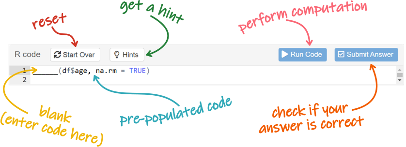
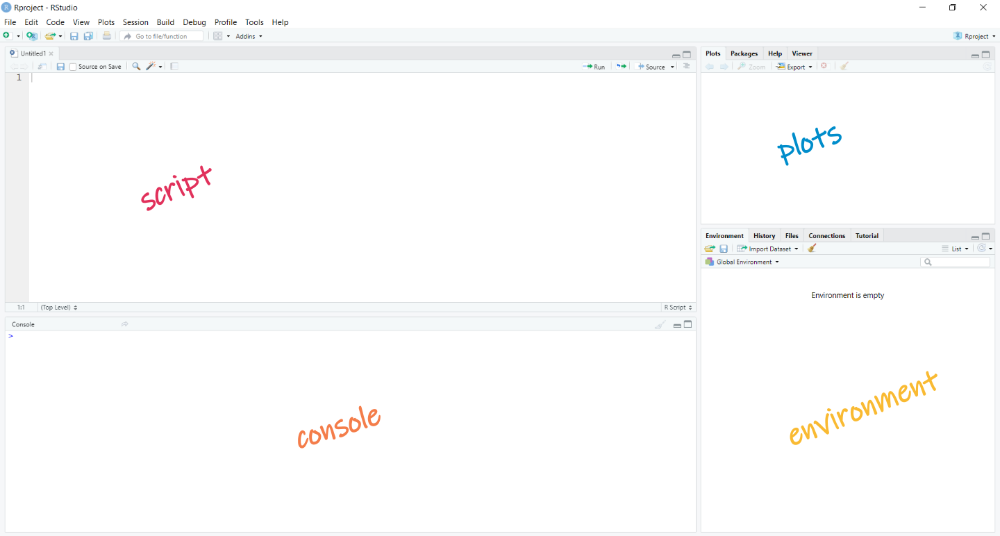
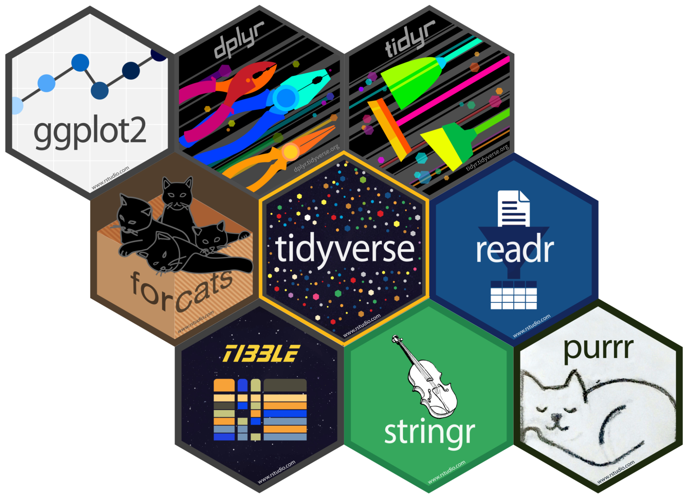
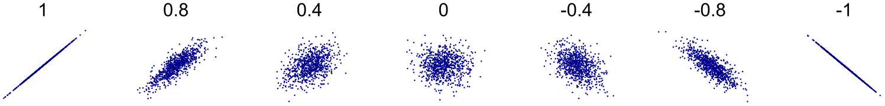
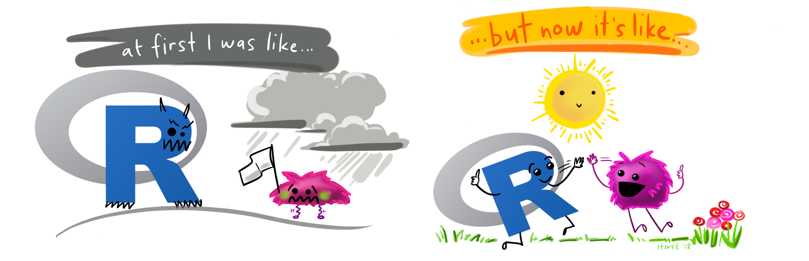

<base target = "_blank"> 

<style>
p.caption {
  font-size: 0.85em; 
}
</style>

```{r setup, include = FALSE}

library(learnr)
library(gradethis)
library(tidyverse)
library(Hmisc)

summarize = dplyr::summarize

df <- read.csv("data/tutorial_data.csv")

# tutorial options
tutorial_options(
  # globally disable code completion
  exercise.completion = FALSE,
  # code running in exercise times out after 2 min
  exercise.timelimit = 120,
  # use gradethis for checking
  exercise.checker = gradethis::grade_learnr
  )

# hide non-exercise code chunks
knitr::opts_chunk$set(echo = FALSE)

```


<a rel="license" href="http://creativecommons.org/licenses/by-nc-sa/4.0/"></a> This tutorial was created by Nuria Doñamayor and Lara Wieland, and is licensed under a <a rel="license" href="http://creativecommons.org/licenses/by-nc-sa/4.0/">Creative Commons Attribution-NonCommercial-ShareAlike 4.0 International License</a>.


## Intro to R tutorial

Welcome to our Intro to R tutorial!

R is a programming language that is widely used by scientists of all fields and is currently the [7th](https://pypl.github.io/PYPL.html) most popular programming language. RStudio provides a free software environment for statistical computing (development and analysis) and graphics.

So if you want to do any type of scientific work (including your thesis), chances are you are going to run into R at some point! 


### 


### Why do we like R so much?

```{r fig1, echo = FALSE, out.width = "60%", fig.align = "center", fig.cap = "Artwork by [@allison_horst](https://twitter.com/allison_horst), licensed under [CC BY 4.0](https://creativecommons.org/licenses/by/4.0/)"}

knitr::include_graphics("https://cdn.myportfolio.com/45214904-6a61-4e23-98d6-b140f8654a40/358e3ecd-32dd-493b-a2b0-12bafabf186c_rw_1920.png?h=de610469af9bdb8078c5030cbf17a151")

```

Well, let's start with the obvious: **R is free and open-source!** Absolutely everyone with a computer and an internet connection can install it and get to work, everywhere in the world. Since R is issued under a GNU General Public License, end users can run, study, share and modify the software as they like. Proprietary software (e.g. SPSS, SAS, Stata) costs a lot of money per end-user license, hindering access to less wealthy individuals, institutions and even nations.

**R facilitates reproducible research.** You might have heard of the [replication or reproducibility crisis](https://en.wikipedia.org/wiki/Replication_crisis). Though R might not be the panacea, there are at least two ways in which R increases the reproducibility of your research:

- Think the typical spreadsheet: Your data are displayed on a nice, understandable format, which you can easily scroll through. However, every change you make to your data is permanent (e.g. data transformations, value deletions... intentional or not!). If a colleague "inherits" your spreadsheet, they won't be able to trace back your actions. This does not happen with R: raw data are loaded onto your workspace, but the actual file and its values remain untouched - every change will take place solely on your workspace.

- Think the typical statistical software interface: Very user-friendly, you just have to scroll through drop-down menus and click on the options of your liking. Once again, your potential colleague is going to have a hard time figuring out which buttons you clicked and in which order. This does not happen with R: every action you take will be documented in your code, so everyone with access to it will be able to replicate exactly what you did.

**R is very flexible.** R is maintained by a very active community of users. These are not just a bunch of guys trying to correctly implement the most common statistical tests, they are statisticians and data analysts developing and using statistical analyses. This makes R really up-to-date when it comes to current analysis techniques: [parametric](https://en.wikipedia.org/wiki/Parametric_statistics), [nonparametric](https://en.wikipedia.org/wiki/Nonparametric_statistics), [robust](https://en.wikipedia.org/wiki/Robust_statistics), [Bayesian](https://en.wikipedia.org/wiki/Bayesian_statistics), [MCMC](https://en.wikipedia.org/wiki/Markov_chain_Monte_Carlo), [GLMM](https://en.wikipedia.org/wiki/Generalized_linear_mixed_model)... the sky's your limit!

Last but not least, **R can do awesome graphics!** Thanks to libraries (more on that later) like *ggplot2*, R is well known for producing state-of-the-art plots and is very flexible when it comes to manipulating plot parameters (e.g. colors, legends). Data visualization can help you better understand your data and is also just plain fun! If you want to know how far you could go when plotting in R, check out this [gallery](https://www.r-graph-gallery.com/) of pretty much every plot you could imagine.

  
### Learning goals

1. Get acquainted with R
2. Review some basic statistical concepts
3. Practice writing simple analysis code


### How to use this tutorial

All tutorials in this course are conceived so you can go though them on your own and set your own learning pace. You can go back to them anytime, do them whenever you like and repeat them as often as you want. So, let's dive into the actual structure of our tutorials! 

Every subsection will start with some introductory information about the topic at hand. All the information you need to know will most likely be there, but now and again you will find a [link](https://techterms.com/definition/hyperlink) within the text. Some of these links will take you to pages where you can get extra info, whereas others are just there in case you need a reminder of some basic concepts, and others will explain concepts of computing and coding, with which you might not be familiar but are outside the scope of this course. Don't feel the need to go through every single linked page in depth, these are just meant to help you out in case of need. 

But let's not forget the learning goals of this tutorial, which means you're going to do some coding! Because of the introductory nature of this course, all coding exercises will be short and sweet.

<div class = "exercise_instruction"> 

Coding exercises will be preceded by brief instructions. We have used a different font and color from the rest of the text so you cannot miss them. 

</div> 

```{r fig2, echo = FALSE, out.width = "80%", fig.align = "center"}



```

Most of the time, the exercises will contain pre-populated code with blanks that you need to fill in. Once you're done, you can "run" the code and see your results. Some of the exercises also include hints and/or have a specific correct answer, in which case you'll see those additional buttons. 

<div class = "hot_tip">

**TIP**

Occasionally you will also get tips in boxes like this.

In this tutorial, they'll mostly have to do with exercise usage and code. 

</div>

<p></p>

Finally, every once in a while you will get to test your newly or not-so-newly acquired knowledge with short quizzes. 

```{r how-to-question}

question(
  
  "Aren't quizzes awesome?",
  
  answer("They're a great way to reinforce my stats skills!", correct = TRUE),
  answer("Oh, no! I hate stats!"),
  
  allow_retry = TRUE,
  random_answer_order = TRUE,
  
  correct = "Lovely, let's go!",
  incorrect = "Are you sure? We'll do our best to convince you otherwise!"
  
)

```

And that's basically how it works, so let's get down to business!


## Getting acquainted with R


### The RStudio environment

**RStudio** is an integrated development environment (IDE) for R. Apart from the cloud version you are currently using, there is a [desktop version](https://rstudio.com/products/rstudio/download/) you can download and install on most operating systems. 

```{r fig3, echo = FALSE, out.width = "100%", fig.align = "center", fig.cap = "The RStudio environment"}



```

Let's take a look at the different panes (the layout differs slightly between cloud and desktop versions):

- In the **script** pane (top left) you can write and modify your [scripts](https://techterms.com/definition/script), which you can save and use to execute your analyses
- The **console** pane (bottom left) is where you can directly enter [commands](https://en.wikipedia.org/wiki/Command_(computing)) (that will not be stored) and where your output will be printed
- The *environment* pane (bottom right) contains several interesting tabs:
  + The **environment** tab lists all variables (more on that later) or objects you have loaded in R
  + The **history** tab contains all commands you have typed into the console during a session
  + The **files** tab is simply a file explorer, in which you can navigate through your folders
  + The **connections** tab shows any [connections](https://db.rstudio.com/tooling/connections/) you have made to supported data sources
  + In the **tutorial** tab you can find a list of RStudio tutorials (not the ones you'll be using throughout this module)
- The *plots* pane (top right) also contains several tabs:
  + In the **plots** tab you'll get to see your plots, which you can also export and save from there (or using the corresponding command in your script)
  + In the **packages** tab you can find a list of installed packages (more on that later)
  + The **help** tab will show the output of any help command you type
  + The **viewer** tab is an advanced tab for local web content

<div class = "hot_tip">

**TIP**

If you want to learn more about the RStudio IDE, take a look at this [cheatsheet](https://raw.githubusercontent.com/rstudio/cheatsheets/main/rstudio-ide.pdf).

</div>


### Arithmetic with R

At its most basic, you can use R as a calculator using the usual operators:

- Addition: +
- Subtraction: -
- Multiplication: *
- Division: /
- Exponentiation: ^

<div class = "exercise_instruction"> 

Try writing some basic arithmetic operations here and then run the code. 

</div> 

```{r basic-arithmetic, exercise = TRUE}

```


<div class = "hot_tip">

**TIP**
      
Remember you can click on 'Start over' anytime to delete all the code you've written and start again.
    
</div>


### Commenting code

Before going further with types of data in R, let's briefly talk about something you'll come across a lot during this tutorial and your further coding life: Comments. 

**Comments** are notes written in plain language that are used e.g. to improve code readability or provide explanations about the code. Comments are ignored by the [compiler](https://techterms.com/definition/compiler) and have no influence on your output whatsoever. Because of this, they also come in handy if, for some reason, you want to prevent specific lines of code from (temporarily) running. 

In R, any line preceded by a **#** will be interpreted as a comment. To distinguish it from executable code, comments will also be colored <span style = "color:green; font-weight:900;">green</span>. 


### Variables

A variable is a memory location used to store values. In R, you can assign values to a variable using **`<-`**, e.g. `my_var <- 4` assigns the value `4` to the variable `my_var`.

<div class = "exercise_instruction"> 

Assign the value 42 to `my_var`, then click on <span class = "exercise_instruction_nonitalicized">'Submit answer'</span>.

</div>

```{r variables, exercise = TRUE, exercise.lines = 5}

my_var <- ______

# check the assignment by typing my_var to print out the value on the console
my_var

```

```{r variables-check}

grade_result(
  
  pass_if(~ identical(as.numeric(.result[1]), 42), ""),
  fail_if(~ TRUE, "Not quite!")

)

```


### Vectors and data frames

Vectors are basic data structures in R. These one-dimensional arrays can contain numeric, character or logical data. Importantly, they can only contain a single type of data, i.e. numeric vectors can only contain numbers, character vectors can only contain letters or words, and logical vectors can only contain TRUE/FALSE values. You can combine values to form a vector using **`c()`**, a generic function to combine pieces of data (more on functions later).

<div class = "exercise_instruction">

Run the following code to create some vectors.

</div>

```{r vectors, exercise = TRUE, exercise.lines = 12}

# combine elements using the function c()
numeric_vector <- c(3, 8, 10)
numeric_vector

# characters need to be written within quotes
character_vector <- c("three", "eight", "ten")
character_vector

# this vector indicates whether the values in the vectors above are odd or not
logical_vector <- c(TRUE, FALSE, FALSE)
logical_vector

```


### 

Most datasets you'll work with will be stored in data frames. In a data frame, each column represents a variable and each row an observation. Also, data frames can contain several types of data at once. Just like in a spreadsheet!

<div class = "exercise_instruction">

Combine the previous vectors to create a data frame. Notice how you first assign the variables to `my_df`, which is done silently, and then type `my_df` to have R print out its contents. </div>

<!-- prepare vectors for the subsequent exercise -->
```{r prepare-vectors}

numeric_vector <- c(3, 8, 10)
character_vector <- c("three", "eight", "ten")
logical_vector <- c(TRUE, FALSE, FALSE)

```

```{r dataframe, exercise = TRUE, exercise.setup = "prepare-vectors"}

my_df <- data.frame(character_vector, numeric_vector, logical_vector)
my_df

```


### Loading and inspecting a data frame

Now that you've gotten to know some data structures in R, you can build onto that. Let's start by importing our own dataset into R.

Our dataset is in a CSV (comma-separated values) file, so you'll use the function **`read.csv()`** to import it. But R can import a variety of other formats, such as tab-separated values, Excel, SPSS, SAS etc. (take a look at the [data import cheatsheet](https://posit.co/wp-content/uploads/2022/10/data-import.pdf) to learn more).

<div class = "exercise_instruction">

Run the following code to import the tutorial dataset. Unless there's an error when importing a file, this action will look like nothing happened, because you are only assigning the dataset to a data frame you're naming `df`, but are not asking R to print it out. 

</div>

```{r read-dataframe, exercise = TRUE}

# the function read.csv imports a comma-separated values (CSV) file and stores it in a data frame
df <- read.csv("data/tutorial_data.csv")

```


### 

This dataset contains simulated data of patients and healthy controls. Apart from the self-explanatory variables ID, group, gender and age, the dataset includes questionnaire scores from the [Peters' Delusions Inventory](https://academic.oup.com/schizophreniabulletin/article/30/4/1005/1930847) (pdi), the [Beck Depression Inventory II](https://naviauxlab.ucsd.edu/wp-content/uploads/2020/09/BDI21.pdf) (bdi) and the [Alcohol Use Disorders Identification Test](https://www.who.int/publications/i/item/WHO-MSD-MSB-01.6a) (audit), as well as the number of achieved reversal stages (revNum) and reaction times (revRT) from a probabilistic reversal task ([here](https://www.jneurosci.org/content/jneuro/22/11/4563.full) you can find a paper describing such a task).

There are several things you can do to explore a dataset you've just imported. This step is essential, as you want to make sure that your data have been imported properly, e.g. that the values are in the appropriate format and in the correct columns, that the column names still make sense etc. The following are just three examples of how you can explore your `df` data frame.

<div class = "exercise_instruction">

You can look at the header (column names) and the first few rows of the data frame with the function **`head()`**.

</div>

```{r head-dataframe, exercise = TRUE, exercise.lines = 2}

head(df)

```


<div class = "exercise_instruction">

To see whether your variables are [integers](https://techterms.com/definition/integer) (<span class = "exercise_instruction_nonitalicized">int</span>), [character strings](https://techterms.com/definition/string) (<span class = "exercise_instruction_nonitalicized">chr</span>), [factors](https://www.stat.berkeley.edu/~s133/factors.html) etc., you can explore the structure of the data frame with the function **`str()`**. 

</div>

```{r str-dataframe, exercise = TRUE, exercise.lines = 2}

str(df)

```


<div class = "exercise_instruction">

And you can obviously also print out the whole data frame. 

</div>

```{r view-dataframe, exercise = TRUE, exercise.lines = 2}
df

```


### Functions

Functions are blocks of reusable code used to perform specific computations. Results from these computations can then be stored in other variables or objects. You may recall that you have already used a couple of functions: `c()`, `data.frame()`, `read.csv()`, `head()`, `str()`. With a bit of coding experience, you can program  your own functions. But rest assured, R comes with loads of them, so chances are there's already one for whatever you want to compute!

To get help for an existing function, type **`help(name_of_function)`** into the Console.

<div class = "exercise_instruction">

Try getting help for the mean with the following code. 

</div>

```{r help-mean, exercise = TRUE, exercise.lines = 2}

help(mean)

```


### 

Let's start by getting acquainted with some functions to calculate descriptive statistics. You can apply these to individual variables of interest by specifying the variable (column) of your data frame with **`name_of_dataframe$name_of_column`**.

<div class = "exercise_instruction">

Try calculating the mean age of your whole group. Does the output make sense?

</div>

```{r mean-age, exercise = TRUE, exercise.lines = 2}

mean(df$age)

```


### 

If your variable contains NA (not available) values, some functions might not know how to deal with them properly. Luckily, most functions have a set of optional parameters to inform the function about particular properties of the data or specific ways in which to treat it. 

<div class = "exercise_instruction">

Try calculating the mean again, but this time specify that NA values should be removed using the option **`na.rm`**. 

</div>

```{r mean-age-na, exercise = TRUE, exercise.lines = 2}

mean(df$age, na.rm = TRUE)

```


### 

<div class = "exercise_instruction">

Now try calculating the median age and click on <span class = "exercise_instruction_nonitalicized">'Submit answer'</span> when you're done.

</div>

```{r median-age, exercise = TRUE, exercise.lines = 2}

______(df$age, na.rm = TRUE)

```

```{r median-age-hint}

Try the function median()

```

```{r median-age-solution, exercise.reveal_solution = FALSE}

median(df$age, na.rm = TRUE)

```

```{r median-age-check}

grade_code("Great job calculating the median!")

```


<div class = "hot_tip">

**TIP**
      
Remember that you can click on 'Hints' if you need some help!
    
</div>


### 

```{r mode-median-mean-question}

question(
  
  "Which of the following statements are true? (choose all correct answers)",
  
  answer("The mode is the most frequently occurring value or values in a dataset", correct = TRUE),
  answer("Mode, median and mean have the same value in a normal distribution", correct = TRUE),
  answer("The median is the value that divides a dataset exactly in half and is very resistant to the influence of extreme values", correct = TRUE),
  answer("Median and mean, but not mode, have the same value in a normal distribution"),
  answer("The mode separates the values of a dataset exactly in half"),
  answer("The mean is the measure of central tendency that is most resistant to the influence of extreme values"),
  answer("The median is calculated by adding all values in a dataset and dividing that by the number of values"),
  
  allow_retry = TRUE,
  random_answer_order = TRUE,
  
  correct = "Great job understanding measures of central tendency!",
  incorrect = "Not quite right! Try again!"
  
)

```


### 

<div class = "exercise_instruction">

Can you also calculate the standard deviation? Click on <span class = "exercise_instruction_nonitalicized">'Submit answer'</span> when you're done. 

</div>

```{r sd-age, exercise = TRUE, exercise.lines = 2}

______(df$age, na.rm = TRUE)

```

```{r sd-age-hint}

Try the function sd()

```

```{r sd-age-solution, exercise.reveal_solution = FALSE}

sd(df$age, na.rm = TRUE)

```

```{r sd-age-check}

grade_code("Great job calculating the standard deviation!")

```


### 

```{r sd-question}

question(
  
  "You have two samples: sample A has a mean of 15 and a standard deviation of 10, sample B has a mean of 20 and a standard deviation of 5. Which sample has a larger spread of observations?",
  
  answer("Sample A", correct = TRUE),
  answer("Sample B"),
  
  allow_retry = TRUE,
  
  correct = "Great job understanding measures of dispersion!",
  incorrect = "Not quite right! Try again!"
  
)

```


### 

<div class = "hot_tip">

**TIP**

Download the [Base R cheatsheet](https://iqss.github.io/dss-workshops/R/Rintro/base-r-cheat-sheet.pdf) to have all this info at hand.

</div>


## Exploring data with R

### Packages

Up to now, we have been using base R functions. But depending on what you want to do, these can be a bit too basic. If you need further functions, apart from trying to code them yourself, you might want to look into available packages.

What is a package? A package is a bundle of functions, data, documentation and tests, which is shared with other R users. As of January 2023, there are [over 19,500 packages](https://cran.r-project.org/web/packages/) available in the CRAN (Comprehensive R Archive Network) repository! So chances are someone else has already coded a function to solve your problem and you can use it by downloading their package.

We are going to introduce the [**tidyverse**](https://tidyverse.tidyverse.org/) package, which automatically loads a couple of other packages that are particularly useful for data wrangling and plotting. 

```{r fig4, echo = FALSE, out.width = "50%", fig.align = "center", fig.cap = "[Hex stickers](https://github.com/rstudio/hex-stickers) for the core [tidyverse packages](https://www.tidyverse.org/packages/)"}



```

In order to use any package, you first need to install it with the function `install.packages()`. Once the package is installed, you have to load it with the function `library()` (even if you've installed it in the same session!). In our tutorials, we've taken care of this for you, but this is how that code would look like.

```{r load-package, eval = FALSE, echo = TRUE}

# you only need to install your package once
install.packages("tidyverse")

# but if you want to use it, you need to load it every time you open a new R session
library(tidyverse)

```


### Inspecting your data with plots

```{r fig5, echo = FALSE, out.width = "65%", fig.align = "center", fig.cap = "Artwork by [@allison_horst](https://twitter.com/allison_horst), licensed under [CC BY 4.0](https://creativecommons.org/licenses/by/4.0/)"}

knitr::include_graphics("https://cdn.myportfolio.com/45214904-6a61-4e23-98d6-b140f8654a40/352c905d-7be3-4808-9514-1fac3b0fe2fc_rw_1920.png?h=e32478e3ccf4317ba2d9536f416e2f90")

```

Before performing any statistical analysis, it is always a good idea to get some descriptive statistics and take a look at your data with some plots.

Don't worry if the code seems a bit complex at the moment, you just need to understand what it does. You'll get used to it if you continue working in R...

<div class = "hot_tip">

**TIP**

From now on, you'll see a lot of comments in the code. Read them to start getting a more detailed sense of what the code does.

Some of the comments will also tell you how to fill in the blanks in the code! 

</div>


### 

So let's start by getting some descriptive values of your participants' age. Since you have a group of patients and a group of healthy controls, you're probably going to want to see each group's descriptive statistics instead of treating them as a single group.

<div class = "exercise_instruction"> 

Fill in the blanks to create a data frame containing your descriptive statistics.

</div>

```{r summary-df, exercise = TRUE, exercise.lines = 8, warning = FALSE}

# this just tells R you'll be working with the df data frame
df %>% 
  # create separate values for each level of your "group" variable (here, patients and healthy controls)
  group_by(group) %>% 
  # compute summary stats - your columns will take the name you input left of the equal sign
  summarize(mean = ______(age, na.rm = TRUE), sd = ______(age, na.rm = TRUE), 
            min = ______(age, na.rm = TRUE), max = ______(age, na.rm = TRUE))

```

```{r summary-df-hint}

Try the functions mean(), sd(), min() and max()

```
  
```{r summary-df-solution, exercise.reveal_solution = FALSE}

df %>% 
  group_by(group) %>% 
  summarize(mean = mean(age, na.rm = TRUE), sd = sd(age, na.rm = TRUE), 
            min = min(age, na.rm = TRUE), max = max(age, na.rm = TRUE))

```

```{r summary-df-check}

grade_code("")

```


<div class = "hot_tip">
      
**TIP**
      
**`%>%`** is the "pipe" operator, which will forward a value or the result of an expression into the next function call or expression. 

Don't worry too much about the code looking complex, you'll get used to it eventually!

</div>


### 

That's nice, your groups appear to be very similar in age! Now, let's visualize the data. 

<div class = "exercise_instruction"> 

To make things easier, let's start by allocating each group's data to their own data frame. 

</div>

```{r pat-hc-df, exercise = TRUE, exercise.lines = 9, warning = FALSE}

# filter your df data frame to get only the data that belongs to the "PAT" (patient group) and assign it to 
# a data frame called df_pat
df_pat <- df %>% 
  filter(group == "PAT")

# now filter df to get only the data of the healthy controls
df_hc <- df %>% 
  filter(group == "______")

```

```{r pat-hc-df-hint}

Remember that the control group is coded as "HC"

```
  
```{r pat-hc-df-solution, exercise.reveal_solution = FALSE}

df_pat <- df %>% 
  filter(group == "PAT")

df_hc <- df %>% 
  filter(group == "HC")

```

```{r pat-hc-df-check}

grade_code("")

```

<!-- prepare df_pat and df_hc for the subsequent exercises -->
```{r prepare-pat-hc-df}

df_pat <- df %>% 
  filter(group == "PAT")

df_hc <- df %>% 
  filter(group == "HC")

```

<div class = "exercise_instruction"> 

If you wish, you can print out your data frames to see if the data has been allocated correctly.

</div>

```{r pat-hc-df-print, exercise = TRUE, warning = FALSE, exercise.setup = "prepare-pat-hc-df"}

```

```{r pat-hc-df-print-hint}

Just type in the names of your data frames

```


### 

<div class = "exercise_instruction"> 

Now plot a basic [histogram](https://www.data-to-viz.com/graph/histogram.html) of your patients' age. 

</div>

```{r plot-hist1, exercise = TRUE, exercise.lines = 7, warning = FALSE, exercise.setup = "prepare-pat-hc-df"}

# this specifies the dataset from which you want to plot and the variables to plot on the x-axis (you only need 
# the x-axis for a histogram, the y-axis is the number of observations)
ggplot(data = df_pat, aes(x = age)) +
  # this specifies the type of graph (histogram), the bin width (2 years), and the color of the inside (fill) 
  # and contour (color) of the bars
  geom_histogram(binwidth = 2, fill = "white", color = "black")

```

###

<div class = "exercise_instruction">

Update your histogram by adding vertical lines to show mean and median. Click on <span class = "exercise_instruction_nonitalicized">'Submit answer'</span> when you're done coding. 

</div>

```{r plot-hist2, exercise = TRUE, exercise.lines = 8, warning = FALSE, exercise.setup = "prepare-pat-hc-df"}

# this is just the previous code
ggplot(data = df_pat, aes(x = age)) +
  geom_histogram(binwidth = 2, fill = "white", color = "black") +
  # add the mean
  geom_vline(xintercept = ______(df_pat$age, na.rm = TRUE), color = "blue2") + 
  # add the median
  geom_vline(xintercept = ______(df_pat$age, na.rm = TRUE), color = "green4")
  
```

```{r plot-hist2-hint}

Try the functions mean() and median()

```
  
```{r plot-hist2-solution, exercise.reveal_solution = FALSE}

ggplot(data = df_pat, aes(x = age)) +
  geom_histogram(binwidth = 2, fill = "white", color = "black") +
  geom_vline(xintercept = mean(df_pat$age, na.rm = TRUE), color = "blue2") + 
  geom_vline(xintercept = median(df_pat$age, na.rm = TRUE), color = "green4")

```

```{r plot-hist2-check}

grade_code("")

```

<div class = "hot_tip">

**TIP**

If you want to explore what colors you can use in your plots, check out [this resource](http://sape.inf.usi.ch/quick-reference/ggplot2/colour).

</div>


###

```{r hist2-question}

question(
  "What does this histogram tell you? (choose all correct answers)",
  
  answer("The age distribution of the patients is skewed to the right (positive skew)", correct = TRUE),
  answer("The median (green) separates the values in exactly half", correct = TRUE),
  answer("The mean (blue) is larger than the median (green) because it is driven by the extreme values at the higher end of the age distribution", correct = TRUE),
  answer("Mean (blue) and median (green) indicate age is normally distributed"),
  answer("The age distribution of the patients is bimodal"),
  answer("The left tail of the distribution appears longer than the right tail"),
  
  allow_retry = TRUE,
  random_answer_order = TRUE,
  
  correct = "Great job understanding what a histogram can tell us!",
  incorrect = "Not quite right! Try again!"
  
)

```


###

<div class = "exercise_instruction">

Now plot a histogram of the control's age with vertical lines for mean and median. Click on <span class = "exercise_instruction_nonitalicized">'Submit answer'</span> after filling in the blanks. 

</div>

```{r plot-hist3, exercise = TRUE, exercise.lines = 7, warning = FALSE, exercise.setup = "prepare-pat-hc-df"}

# specify the data frame you want to plot this time
ggplot(data = ______, aes(x = age)) +
  geom_histogram(binwidth = 2, fill = "white", color = "black") +
  # you also need to specify the name of the data frame to plot its mean and median
  geom_vline(xintercept = mean(______$age, na.rm = TRUE), color = "blue2") + 
  geom_vline(xintercept = median(______$age, na.rm = TRUE), color = "green4")
  
```

```{r plot-hist3-hint}

Remember that the data frame was called df_hc

```
  
```{r plot-hist3-solution, exercise.reveal_solution = FALSE}

ggplot(data = df_hc, aes(x = age)) +
  geom_histogram(binwidth = 2, fill = "white", color = "black") +
  geom_vline(xintercept = mean(df_hc$age, na.rm = TRUE), color = "blue2") + 
  geom_vline(xintercept = median(df_hc$age, na.rm = TRUE), color = "green4")

```

```{r plot-hist3-check}

grade_code("")

```


###

```{r hist3-question}

question(
  
  "What do these two histograms tell you? (choose all correct answers)",
  
  answer("The age distribution of the healthy controls is bimodal", correct = TRUE),
  answer("Although the means (blue) of both groups are practically identical, the median (green) age of the controls is smaller than that of the patients", correct = TRUE),
  answer("Despite their mean age being 31, none of the healthy controls were 31 years old", correct = TRUE),
  answer("The age distribution of both groups is similar"),
  answer("The age distribution of the healthy controls is skewed to the left (negative skew)"),
  answer("The mode of the healthy controls is approx. 26 years old"),
  
  allow_retry = TRUE,
  random_answer_order = TRUE,
  
  correct = "Awesome understanding of data visualization!",
  incorrect = "Not quite right! Try again!"
  
)

```

### 

As you have seen, you can find quite different data configurations hiding behind pretty similar descriptive statistics. So now you probably have a good sense of why you should always plot your data. But in case you still think it might be a waste of time, the [Datasaurus dozen](https://www.research.autodesk.com/publications/same-stats-different-graphs/) (based on the original Datasaurus, created by [Alberto Cairo](http://www.thefunctionalart.com/2016/08/download-datasaurus-never-trust-summary.html)) should drive the point home!

```{r fig6, echo = FALSE, out.width = "75%", fig.align = "center", fig.cap = "Extremely different datasets have the same overall statistical properties (to two decimal places) shown on the right (from [*Same Stats, Different Graphs*](https://www.research.autodesk.com/publications/same-stats-different-graphs/) by [Justin Matejka](https://www.research.autodesk.com/people/justin-matejka/) and [George Fitzmaurice](https://www.research.autodesk.com/people/george-fitzmaurice/))."}

knitr::include_graphics("https://www.research.autodesk.com/app/uploads/2023/03/DinoSequential-1.gif")

```


## Analyzing data with R

Now that you have explored your data with plots, you'll want to perform some statistical tests on them. Needless to say, which tests you decide to use will depend on your hypotheses. E.g. do you expect differences between two or more conditions and/or groups? Or do you hypothesize a linear or non-linear relationship between certain variables?

```{r fig7, echo = FALSE, out.width = "65%", fig.align = "center", fig.cap = "Illustration from the [Openscapes](https://openscapes.org/) blog [Tidy Data for reproducibility, efficiency, and collaboration](https://openscapes.org/blog/2020-10-12-tidy-data/) by Julia Lowndes and [Allison Horst](https://twitter.com/allison_horst), licensed under [CC BY 4.0](https://creativecommons.org/licenses/by/4.0/)"}

knitr::include_graphics("https://cdn.myportfolio.com/45214904-6a61-4e23-98d6-b140f8654a40/209ee1eb-fd83-4e4c-9bed-82ae43b0f3e9_rw_1920.jpg?h=e57409fd5269656f2f4a4d9135cd18a4")

```

We are going to focus on 
[frequentist statistics](https://infotrust.com/articles/bayesian-vs-frequentist-methodologies-explained-in-five-minutes/) and particularly on parametric tests, which are the most widely used. Parametric tests rely on a set of rigid assumptions, e.g. that the sampling distribution is normally distributed. If these assumptions are not met and you use parametric tests, your results are likely to be inaccurate. For simplicity's sake, we are not going to get into checking assumptions, but if you're interested, check out the optional tutorial <span style = "color:#008080">***Optional_Parametric_Assumptions.Rmd***</span> in the *Files* tab.


### 

### 

For starters, a quick refresher on measurement scales. As you probably know, there are four [levels of measurement](https://dictionary.apa.org/measurement-scale):

1. **Nominal scales** categorize data based on membership to a named group.
2. **Ordinal scales** numerically rank data from highest to lowest or vice versa.
3. In **interval scales** the differences between numerical values are equidistant, but the zero point is arbitrary.
4. **Ratio scales** also provide equidistance between values, but the zero point is meaningful (i.e. it signifies the absence of that particular measure).


```{r scales-question}

question(
  
  "Which of the following measures is *not* on a nominal scale?",
  
  answer("German grades (1-6)", correct = TRUE),
  answer("Postal code"),
  answer("Place of residence"),
  answer("Blood type"),
  
  allow_retry = TRUE,
  random_answer_order = TRUE,
  
  correct = "Great job understanding scale levels!",
  incorrect = "Not quite right! Try again!"
  
)

```


### 

Let's also briefly talk about types of variables:

- **Independent variables** are those that are specifically manipulated by the experimenter in order to assess their effect on the dependent variables.
- **Dependent variables** are the observed outcomes following changes in the independent variables.
- **Confounding variables** systematically vary with the independent variable, making it impossible to differentiate their effect from that of the intended experimental manipulation.
- **Mediator variables** are unseen processes in the causal chain between the independent and dependent variables.
- **Moderator variables** are additional variables that change the nature of the relationship between the independent and dependent variables.


```{r variables-question}

question(
  
  "You have designed an experiment to probe the effect of alcohol consumption on reaction time. Which of the following is your independent variable?",
  
  answer("Degree of alcohol consumption", correct = TRUE),
  answer("Reaction time"),
  answer("Participant gender"),
  answer("Presence or absence of an alcohol dependence diagonsis"),
  
  allow_retry = TRUE,
  random_answer_order = TRUE,
  
  correct = "Great job understanding variable types!",
  incorrect = "Not quite right! Try again!"
  
)

```


### Relating two variables

Let's jump into looking at how two continuous variables relate to each other by calculating the correlation coefficient, which quantifies the linear relationship between two variables. Correlation coefficients range from −1 to +1, where ±1 indicates the strongest possible linear relationship and 0 a lack of relationship.

```{r fig8, echo = FALSE, out.width = "100%", fig.align = "center", fig.cap = "The image above depicts several sets of data points and their corresponding Pearson's correlation coefficients ([original](https://commons.wikimedia.org/wiki/File:Correlation_examples2.svg) licensed under [CC0](https://creativecommons.org/share-your-work/public-domain/cc0/))"}



```

Note that correlation coefficients quantify **linear** relationships. Data points might be related in a *non-linear* fashion and a correlation will not be able to capture these relationships adequately. Take a look at the following image:

```{r fig9, echo = FALSE, out.width = "100%", fig.align = "center", fig.cap = "The image above depicts quadratic and quartic relationships, and data clustering; note how the Pearson's correlation coefficient cannot adequately reflect these types of relationships ([original](https://commons.wikimedia.org/wiki/File:Correlation_examples2.svg) licensed under [CC0](https://creativecommons.org/share-your-work/public-domain/cc0/))"}


```


### 

Take a look at the following figure:

```{r fig10, echo = FALSE, out.width = "60%", fig.align = "center", fig.cap = "Relationship between global average temperature and number of pirates (the numbers above the points represent the year of measurement; [image](https://commons.wikimedia.org/wiki/File:PiratesVsTemp(en).svg) by [RedAndr](https://commons.wikimedia.org/wiki/User:RedAndr), licensed under [CC BY-SA 3.0](https://creativecommons.org/licenses/by-sa/3.0/deed.en))"}

knitr::include_graphics("https://upload.wikimedia.org/wikipedia/commons/d/de/PiratesVsTemp%28en%29.svg")

```

```{r corr-caus-question}

question(
  
  "This graph shows how, over the years, global temperature has risen as the number of pirates has decreased. With which of the following statements do you agree? (choose all correct answers)",
  
  answer("We cannot make any causal claims from a correlation", correct = TRUE),
  answer("The correlation might be due to chance or a third unknown variable", correct = TRUE),
  answer("Pirates contributed to global temperature stability through their maritime looting activity"),
  answer("Over the years, more and more pirates are giving up their business due to increased heat and associated storms"),
  answer("The decrease in number of pirates is causing sea levels to go up and further heating of the poles"),
  
  allow_retry = TRUE,
  random_answer_order = TRUE,
  
  correct = "Exactly!",
  incorrect = "Not quite right! Try again!"
  
)
```


### 

You might be thinking this was a really dumb example. However, it introduces an extremely important topic: **correlation does not imply causation**. While this is quite obvious in examples such as the above or the infamous [spurious correlation of Nicolas Cage movies and drowning](https://www.nationalgeographic.com/science/phenomena/2015/09/11/nick-cage-movies-vs-drownings-and-more-strange-but-spurious-correlations/), it can be less self-evident with real data. It can also be quite a tempting explanation, especially when a plausible causal mechanism exists. After all, we are all wired to interpret contiguity as causality. So just repeat it like a mantra: [correlation does not imply causation](https://en.wikipedia.org/wiki/Correlation_does_not_imply_causation). 

### 

In the following example, you are going to test whether the scores from the [Beck Depression Inventory II (BDI-II)](https://naviauxlab.ucsd.edu/wp-content/uploads/2020/09/BDI21.pdf) and the [Peters' Delusions Inventory (PDI)](https://academic.oup.com/schizophreniabulletin/article/30/4/1005/1930847) are related.

<div class = "exercise_instruction">

Start by looking at the data using a [scatterplot](https://www.data-to-viz.com/graph/scatter.html).

</div>

```{r bdi-pdi-scatterplot, exercise = TRUE, exercise.lines = 5, warning = FALSE}

ggplot(data = df, aes(x = bdi, y = pdi)) +
  geom_point(size = 2) +
  # this adds nicer labels to the axes
  labs(x = "BDI-II score", y = "PDI score")

```


### 

You can use two different functions to calculate Pearson's *r* correlation coefficient: **`cor()`** and **`cor.test()`**. While the value of the coefficient will be identical, the advantage of `cor.test()` is that it delivers further values, such as confidence intervals and test statistics. And, after all, you're probably interested in both the strength of the relationship and whether it is significant, aren't you? But what does *significant* actually mean?

```{r pvalue-question}

question(

  "What do *p*-values indicate?",

  answer("The probability of obtaining a certain test statistic (or a more extreme one) given the null hypothesis is true", correct = TRUE),
  answer("The probability that the null hypothesis is true", message = "That is a common misunderstanding! Try again!"),
  answer("The probability of the type I error", message = "Close! That is the probability of incorrectly rejecting the null hypothesis (*α*), which is usually set at 5%. Try again!"),
  answer("The probability that the alternative hypothesis is true", message = "Not quite right! That is a common misinterpretation of (1 - *p*-value). Try again!"),
  
  allow_retry = TRUE,
  random_answer_order = TRUE,
  
  correct = "Great job understanding the *p*-value! You can read more about it [here](https://tidsskriftet.no/en/2015/09/why-p-value-significant-0), if you wish."
  
)

```


### 

<div class = "exercise_instruction">

Now calculate Pearson's <span class = "exercise_instruction_nonitalicized">r</span> correlation coefficient (<span class = "exercise_instruction_nonitalicized">cor</span> in the output) using the function **`cor.test()`** in order to formally test for the linear relationship between BDI-II and PDI scores.

</div>

```{r bdi-pdi-cortest, exercise = TRUE, exercise.lines = 4}

# both correlation functions take the form (variable1, variable2, options)
# the option 'method' is set to "pearson" to calculate Pearson's correlation coefficient
______(df$bdi, df$pdi, method = "pearson")

```

```{r bdi-pdi-cortest-solution, exercise.reveal_solution = FALSE}

cor.test(df$bdi, df$pdi, method = "pearson")

```

```{r bdi-pdi-cortest-check}

grade_code("")

```


### 

```{r bdi-pdi-cortest-question}

question(

  "What does the correlation tell us?",

  answer("The *p*-value is smaller than 0.05 and the *r*-value is 0.55, meaning there is a significant, moderate positive correlation between BDI-II and PDI scores", correct = TRUE),
  answer("The *p*-value is larger than 0.1 and the *r*-value is 0.55, meaning there is no significant correlation between BDI-II and PDI scores"),
  answer("The *p*-value is smaller than 0.1 and the *r*-value is 0.37, meaning there is no significant correlation between BDI-II and PDI scores"),
  answer("The *p*-value is larger than 0.05 and the *r*-value is 0.37, meaning there is a significant, strong positive correlation between BDI-II and PDI scores"),
  
  allow_retry = TRUE,
  random_answer_order = TRUE,
  
  correct = "Great job understanding the correlation results!",
  incorrect = "Not quite right! Try again!"
  
)

```


###

As you can see, the output shows a couple of things apart from the *r*- and *p*-values. Let's take a look at what these values actually mean. 

- The ***t*-value** (*t*) represents the size of the difference between your variables (the signal) relative to the amount of variation in your data (the noise). This concept will probably become easier to understand in the context of the t-test, which you'll see next.
- **Degrees of freedom** (*df*) are a particularly difficult concept. Simplifying, they are the the number of values that can vary freely when estimating a statistical parameter. You can read more about them [here](https://dictionary.apa.org/degrees-of-freedom), [here](https://blog.minitab.com/en/statistics-and-quality-data-analysis/what-are-degrees-of-freedom-in-statistics) or [here](https://en.wikipedia.org/wiki/Degrees_of_freedom_(statistics)). 
- The **confidence interval** is a range of values around your statistic (here, around the correlation coefficient) that are thought to contain the true (population) value of said statistic with a certain probability (here, 95%). 


###

Looking at the scatterplot above, you might be missing something you're used to seeing: a line going through the points. 

This line is called a regression line and is obtained through a slightly different statistical test: simple linear regression. While Pearson's correlation and simple linear regression are technically equivalent (if you want to know more, check out the optional tutorial <span style = "color:#008080">***Optional_Statistical_Tests_as_LMs.Rmd***</span> in the *Files* tab), be mindful, because they answer slightly different questions! 

A correlation analysis informs about the strength and direction of the linear relationship between two variables, X and Y. A simple linear regression analysis estimates parameters in a linear equation that can be used to predict values of one variable, Y, based on the other, X, i.e. regression attempts to predict how changes in variable X cause variable Y to change. 

<div class = "exercise_instruction">

Let's plot the scatterplot again and add the regression line.

</div>

```{r bdi-pdi-lm1, exercise = TRUE, exercise.lines = 6, warning = FALSE}

ggplot(data = df, aes(x = bdi, y = pdi)) +
  geom_point(size = 2) +
  # this adds the regression line
  geom_smooth(method = "lm", se = FALSE) +
  labs(x = "BDI-II score", y = "PDI score")

```


### Comparing two variables

Now let's look whether there are differences in the means of a variable depending on a grouping variable. To test this, you need to use an independent (unpaired) t-test, which determines whether the means of two groups are equal to each other. The [null hypothesis](https://dictionary.apa.org/null-hypothesis) is that the two means are equal (group1 = group2). The [alternative hypothesis](https://dictionary.apa.org/alternative-hypothesis) is that the two means differ (group1 ≠ group2). 

In this example, you are going to test whether there are differences in the score of the [Alcohol Use Disorders Identification Test (AUDIT)](https://www.who.int/publications/i/item/WHO-MSD-MSB-01.6a) depending on gender.

<div class = "exercise_instruction">

You'll start by looking at the mean and standard deviation of the AUDIT scores in each group. Don't forget to name your columns and to set the `na.rm` option correctly to get a meaningful output!

</div>

```{r df-summarize, exercise = TRUE, exercise.lines = 7}

# from your df data frame
df %>%
  # create separate values for each level of gender
  group_by(gender) %>%
  # compute summary stats
  summarize(n = n(), ______ = mean(audit, na.rm = ______), ______ = sd(audit, na.rm = ______))

```

```{r df-summarize-hint}

The na.rm option can only take logical values, i.e. TRUE or FALSE

```


### 

Because you are going to use a t-test, the independent variable (gender) can only have two levels (if you wanted to analyze more than two levels, you would have to use the more complex analysis of variance or ANOVA for short; if you're interested in how to compare more than two means, check out the optional tutorial <span style = "color:#008080">***Optional_Comparing_Several_Variables.Rmd***</span> in the *Files* tab). Let's get rid of gender "k", which only has 7 observations.

<div class = "exercise_instruction">

You are going to create a new data frame called `df_gender_audit` with only the variables you need for your analysis. Note how this time the whole code is enclosed in parentheses and watch out for what happens.

</div>

```{r df-gender-audit, exercise = TRUE, exercise.lines = 6}

(df_gender_audit <- df %>% 
  # select variables of interest
  select(gender, audit) %>% 
  # remove subjects with unknown gender or missing AUDIT values (NA)
  filter(gender != "k" & !is.na(audit)))

```

<!-- prepare df_gender_audit for the subsequent exercises -->
```{r prepare-df-gender-audit}

df_gender_audit <- df %>% 
  select(gender, audit) %>% 
  filter(gender != "k" & !is.na(audit))

```


### 

<div class = "hot_tip">

**TIP**
      
In R, you can use [parentheses](https://stat.ethz.ch/R-manual/R-devel/library/base/html/Paren.html) to [evaluate an expression](https://en.wikipedia.org/wiki/Expression_(computer_science)). In cases such as the above, you can use them as a shortcut to print out the result of your assignment. Therefore, e.g. both

`x <- c(20, 63)`<br> `x`

and

`(x <- c(20, 63))`

will print out `20 63` on the console, but the latter requires one less line of code.
    
</div>


### 

<div class = "exercise_instruction">

Let's start by looking at the data using a [boxplot](https://www.data-to-viz.com/caveat/boxplot.html).

</div>

```{r gender-audit-boxplot, exercise = TRUE, exercise.lines = 4, exercise.setup = "prepare-df-gender-audit"}

ggplot(data = df_gender_audit, aes(x = gender, y = audit)) +
  geom_boxplot() +
  labs(y = "AUDIT score")

```


### 

<div class = "exercise_instruction">

Calculate a [t-test](https://en.wikipedia.org/wiki/Welch%27s_t-test#Calculations) in order to formally test for differences in AUDIT scores between genders.

</div>

```{r gender-audit-ttest, exercise = TRUE, exercise.lines = 5, exercise.setup = "prepare-df-gender-audit"}

# the t.test function takes the form t.test(dependent variable ~ independent variable, options)
# the option 'paired' is set to FALSE (the default) because you are computing an independent-samples t-test
# for a paired t-test, you would need to set the option 'paired = TRUE'
t.test(df_gender_audit$______ ~ df_gender_audit$______, paired = FALSE)

```

```{r gender-audit-ttest-hint}

Remember your variables are named gender and audit

```

```{r gender-audit-ttest-solution, exercise.reveal_solution = FALSE}

t.test(df_gender_audit$audit ~ df_gender_audit$gender, paired = FALSE)

```

```{r gender-audit-ttest-check}

grade_code("")

```


### 

```{r gender-audit-question}

question(
  
  "What does the t-test tell us?",
  
  answer("The *p*-value is larger than 0.05, meaning men (m) and women (w) use alcohol equally severely", correct = TRUE),
  answer("The *p*-value is smaller than 0.1, meaning men (m) and women (w) use alcohol equally severely"),
  answer("The *p*-value is larger than 0.05, meaning men's (m) alcohol use is significantly less severe than women's (w)"),
  answer("The *p*-value is smaller than 0.1, meaning men's (m) alcohol use is significantly more severe than women's (w)"),
  
  allow_retry = TRUE,
  random_answer_order = TRUE,
  
  correct = "Great job understanding the t-test results!",
  incorrect = "Not quite right! Try again!"

)

```


###

But obviously, as a scientist, you're going to want to take a look at more than just the *p*-values. Most of the values of the output of the t-test should feel familiar by now, since you've already seen them in the correlation output. Actually, the only unfamiliar part should be the sample estimates at the bottom of the output, which as you can probably guess are simply the AUDIT means of each group (men and women).


### 

Prior to performing the t-test, you plotted your data using a boxplot, also called box-and-whisker plot. But let's be honest, boxplots don't look particularly nice and can be [hard to understand](https://nightingaledvs.com/ive-stopped-using-box-plots-should-you/). You might be used to seeing something more along these lines:

```{r fig11, echo = FALSE, out.width = "80%", fig.align = "center", fig.cap = "Bar graph of five groups ([image](https://commons.wikimedia.org/wiki/File:Truncated_Bar_Graph.svg) licensed under [CC0](https://creativecommons.org/share-your-work/public-domain/cc0/))"}

knitr::include_graphics("https://upload.wikimedia.org/wikipedia/commons/9/98/Truncated_Bar_Graph.svg")

```

However, [bar graphs](https://www.data-to-viz.com/graph/barplot.html) are quickly losing popularity among scientists. Originally designed to represent counts and proportions, they become quite [problematic](https://doi.org/10.1074/jbc.RA117.000147) when used to depict summary statistics (e.g. means and standard deviations). Therefore, more researchers are now opting for different kinds of representations, such as [dot plots](https://en.wikipedia.org/wiki/Dot_plot_(statistics)), [violin plots](https://www.data-to-viz.com/graph/violin.html) and a number of fancy combinations (e.g. [raincloud plots](https://wellcomeopenresearch.org/articles/4-63)). Even [some journals](https://www.nature.com/articles/nmeth.2837) are now encouraging veering away from bar plots or at least overlaying data points.

<div class = "exercise_instruction">

Let's try using a violin plot with overlaid summary statistics (mean and [standard error](https://www.ncbi.nlm.nih.gov/pmc/articles/PMC1255808/)) for your data.

</div>

```{r gender-audit-violinplot, exercise = TRUE, exercise.lines = 8, exercise.setup = "prepare-df-gender-audit"}

ggplot(data = df_gender_audit, aes(x = gender, y = audit)) +
  geom_violin() +
  # add points to show the mean
  stat_summary(fun = mean, geom = "point", size = 2) +
  # add error bars to show the standard error of the mean
  stat_summary(fun.data = mean_se, geom = "errorbar", width = .15) +
  labs(y = "AUDIT score")

```


###

With a violin plot you can see that, even if women on average report slightly more severe alcohol use than men, the distributions of the AUDIT scores of both groups widely overlap. This information is easily visually available if you use violin plots, as well as boxplots or dot plots, but totally absent from bar graphs, isn't it? 


### 

But remember, whichever [type of plot](https://www.r-graph-gallery.com/) or analysis you decide to use, it still has to make sense! Take a look at Figure 2A of [this paper](https://journals.sagepub.com/doi/full/10.5772/62322) and ponder why it might have become infamous when it made the rounds on social media...


## Wrap-up

That's it for today! 

You have now become acquainted with the R environment and done a bit of coding. This is just a taster of what you can do with R! It is a very versatile language and, being open source, it is constantly evolving. The possibilities are endless. 

```{r fig12, echo = FALSE, out.width = "100%", fig.align = "center", fig.cap = "Artwork by [@allison_horst](https://twitter.com/allison_horst), licensed under [CC BY 4.0](https://creativecommons.org/licenses/by/4.0/) (modified)"}



```

If you want to learn a bit more about statistics and R, you might be interested in checking out these books:

- [***Discovering statistics using R***](https://charite-berlin.primo.exlibrisgroup.com/discovery/fulldisplay?docid=alma990045287170402883&context=L&vid=49KOBV_FUB:CHA&lang=de&search_scope=CHA_CDI&adaptor=Local%20Search%20Engine&tab=CHA_CDI&query=any,contains,Discovering%20statistics%20using%20R&offset=0) by Andy Field, Jeremy Miles and Zoë Field
- [***Learning statistics with R: A tutorial for psychology students and other beginners***](https://learningstatisticswithr.com) by Danielle Navarro

For hands-on courses, you may consider the following:

- The [**BIH**](https://www.bihealth.org/) organizes a diversity of [events](https://www.bihealth.org/en/news/events), including an [*R Crash Course*](https://www.bihealth.org/de/aktuell/r-crash-course-a-practical-introduction-to-using-r) and a course on [*Reproducible Research with R*](https://www.bihealth.org/de/aktuell/reproducible-research-with-r-1)
- [**Posit Academy**](https://posit.co/products/enterprise/academy/) offers data science training with R (and Python)
- Online learning platforms such as [**DataCamp**](https://www.datacamp.com/) or [**Coursera**](https://de.coursera.org/) offer numerous R courses, from introductory to advanced

And if you're stuck with a specific question, [**StackExchange**](https://stats.stackexchange.com/) will most likely have the answer!

In the next session, you'll get to analyze the real data that you'll acquire yourselves. See you then!

<div style = "text-align: right; font-size: 1.2em; font-family: Indie Flower;">This tutorial was created by [Dr.rer.nat. Nuria Doñamayor](https://scholar.google.com/citations?user=MFJ3j-YAAAAJ&hl=es&oi=ao) & [M.Sc. Lara Wieland](https://scholar.google.com/citations?user=PB8KgtYAAAAJ&hl=es&oi=ao) ([AG Lernen und Kognition](https://psychiatrie-psychotherapie.charite.de/forschung/computational_neuroimaging/ag_lernen_und_kognition/))</div>

