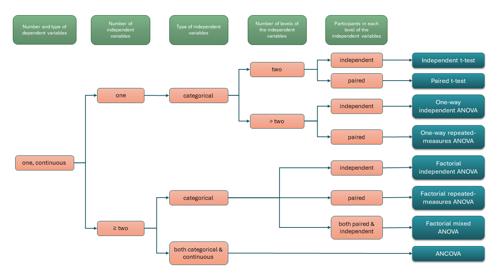

<base target = "_blank">

<style>
p.caption {
  font-size: 0.85em;
}
</style>

```{r setup, include = FALSE}

library(learnr)
library(gradethis)
library(tidyverse)
library(car)
library(ez)

df <- read.csv("data/tutorial_data_ANOVA.csv")

# tutorial options
tutorial_options(
  # globally disable code completion
  exercise.completion = FALSE,
  # code running in exercise times out after 2 min
  exercise.timelimit = 120,
  # use gradethis for checking
  exercise.checker = gradethis::grade_learnr
  )

# hide non-exercise code chunks
knitr::opts_chunk$set(echo = FALSE)
```


<a rel="license" href="http://creativecommons.org/licenses/by-nc-sa/4.0/"></a> This tutorial was created by Nuria Doñamayor and Lara Wieland, and is licensed under a <a rel="license" href="http://creativecommons.org/licenses/by-nc-sa/4.0/">Creative Commons Attribution-NonCommercial-ShareAlike 4.0 International License</a>.


## Optional tutorial: Comparing several variables

Welcome to our optional tutorial on using analysis of variance to compare three or more variables! 

We're happy to have intrigued you about ANOVA in the <span style = "color:#008080">***Intro to R***</span> tutorial! In this tutorial we are going introduce the concept of analysis of variance and take a look at how to apply it to three-group data.

```{r fig1, echo = FALSE, out.width = "90%", fig.align = "center", fig.cap = "Artwork by [@allison_horst](https://twitter.com/allison_horst), licensed under [CC BY 4.0](https://creativecommons.org/licenses/by/4.0/) (modified)"}


```

  
###

  
### Learning goals

1. Understand why ANOVA is necessary 
2. Understand the basic concept of ANOVA
3. Perform an ANOVA and interpret a typical output
4. Plot ANOVA results


### How to use this tutorial

Given that you've already gone through our <span style = "color:#008080">***Intro to R***</span> tutorial, you're probably already quite familiar with the tutorial structure. So let's just do a brief recap. 

As you know, all tutorials in this course are conceived so you can go though them on your own and set your own learning pace. Every subsection will start with some introductory information about the topic at hand, in which you'll occasionally encounter [links](https://techterms.com/definition/hyperlink) with extra info, reminders of basic concepts or notions of computing and coding. As before, you might not need to go through every single linked page in depth, but they can help you out in case of need. 

<div class = "exercise_instruction"> 

Once again, coding exercises will be preceded by brief instructions, which we have highlighted by using a different font and color from the rest of the text. 

</div> 

```{r fig2, echo = FALSE, out.width = "80%", fig.align = "center"}

knitr::include_graphics("images/code_chunk.png")

```

Most of the time, the exercises will contain pre-populated code with blanks that you need to fill in. Once you're done, you can "run" the code and see your results. Some of the exercises also include hints and/or have a specific correct answer, in which case you'll see those additional buttons.

<div class = "hot_tip">

**TIP**

This tutorial also contains tips that might come in handy.

</div>

<p></p>

Finally, there will also be a short quiz or two so you can test your newly or not-so-newly acquired knowledge. 

```{r how-to-question}

question(

  "Don't you find quizzes great to consolidate what you just learned?",
  
  answer("Of course I do!", correct = TRUE),
  answer("Quizzes disgust me!"),
  
  allow_retry = TRUE,
  random_answer_order = TRUE,
  
  correct = "Lovely, let's go!",
  incorrect = "Oh, no! We'll hopefully show your they're a great way to get you to reflect on what you just learned!"
  
)

```

That's it!


## What is ANOVA?

In the <span style = "color:#008080">***Intro to R***</span> tutorial, you used a t-test to analyze whether there were differences in [AUDIT](https://www.who.int/publications/i/item/WHO-MSD-MSB-01.6a) score depending on gender. In that analysis, the participants' AUDIT scores were your [dependent variable](https://dictionary.apa.org/dependent-variable) and gender was your [independent variable](https://dictionary.apa.org/independent-variable), which had two categories or [levels](https://dictionary.apa.org/level): men and women. 

In real research life you will often have independent variables with more than two levels. Sometimes these levels correspond to "natural" categories (e.g. groups with different diagnoses), whereas other times they are assigned by the experimenter (e.g. different medication doses). If you want to explore how these categories differ in a certain dependent variable, you will encounter a whole new species of statistical test: **analysis of variance (ANOVA)**. There are several "subspecies" of ANOVA, depending on your research question and study design.

```{r fig3, echo = FALSE, out.width = "100%", fig.align = "center", fig.cap = "Decision tree of [parametric tests](https://en.wikipedia.org/wiki/Parametric_statistics) used to compare means (for a more complete German version see [here](https://wcms.itz.uni-halle.de/download.php?down=3622&elem=1255189))"}



```


### 

### Why do we need ANOVA?

Of course, you may be asking yourself: Why don't we stick to our good, old-fashioned t-test and just compare each pair of means? 

Well, that's where the so-called [**multiple comparisons problem**](https://en.wikipedia.org/wiki/Multiple_comparisons_problem) comes into play. As you might recall, by convention, we usually set the [significance level](https://dictionary.apa.org/significance-level) of our tests to 0.05, i.e. with every test we conduct, we only allow for a probability of 5% of making a [type I error](https://dictionary.apa.org/type-i-error) or incorrectly rejecting a true [null hypothesis](https://dictionary.apa.org/null-hypothesis). Multiple comparisons occur when multiple statistical tests are used on the same dataset. 

As it turns out, with every additional test, type I error probabilities multiply. On a practical level, this means that it is easier to get a significant result by slicing and dicing your dataset and multiple testing; however, at a huge cost. Just by performing three tests on your dataset, you have increased the type I error probability from 5% to 14.3% (check out [this link](https://grants.hhp.uh.edu/doconnor/pep6305/Multiple%20t%20tests.htm) to calculate it yourself). That means you have almost triplicated the probability of incorrectly finding a significant difference when there is none. 

```{r fig4, echo = FALSE, out.width = "70%", fig.align = "center", fig.cap = "Artwork by [@allison_horst](https://twitter.com/allison_horst), licensed under [CC BY 4.0](https://creativecommons.org/licenses/by/4.0/)"}

knitr::include_graphics("https://cdn.myportfolio.com/45214904-6a61-4e23-98d6-b140f8654a40/49e0e9dd-63c5-435c-9e94-38ee61c5224b_rw_1920.png?h=938bf875e8e6456341336019290469ad")

```

That is why, if you have several levels of your independent variable, you don't just do multiple pairwise comparisons, but completely avoid the multiple comparisons problem by using ANOVA!


### Why is it called analysis of variance if it compares means?

By now you're also probably wondering why this analysis is called analysis of *variance*, if we're constantly talking about comparing *means*. Why not call it analysis of means? As it turns out, ANOVA compares means by analyzing the variances in your data. 

ANOVA compares the **variation *between* the levels** of your variable to the **variation *within* its levels**. The larger the difference between the between-level and within-level variation, the larger the evidence of a difference between level means.


### Assumptions of ANOVA

As you might know by now, parametric tests such as ANOVA require data to comply with certain assumptions regarding e.g. the shape of the sampling distribution, their variance or their level of measurement. If your data do not comply with these assumptions and you still choose to use a parametric test, your results might be inaccurate. ANOVA has the following basic assumptions that must be met to deliver accurate results:

1. At least [interval level](https://dictionary.apa.org/measurement-scale) data
2. Independent data
3. Normal (Gaussian) sampling distribution
4. Homogeneity of variance (homoscedasticity)

The dataset you'll use in this tutorial complies with these assumptions, but if you want to learn more about parametric assumptions, check out the optional tutorial <span style = "color:#008080">***Optional_Parametric_Assumptions.Rmd***</span> in the *Files* tab.


## Reading and exploring the data

### Loading necessary packages

As you saw in the <span style = "color:#008080">***Intro to R***</span> tutorial, if you need functions apart from those in base R, the first step in your script is going to be loading the necessary packages. 

In this tutorial, apart from the **tidyverse** package you're already familiar with, you'll be using the packages **car** and **ez**. The package **car** contains the function **`Anova()`**, which calculates ANOVA tables for various statistical models, and the package **ez** contains the function **`ezANOVA()`**, which offers both an easy way to compute ANOVAs (as the name suggests: "ez" is pronounced /ˈizi/) and a familiar type of output.

In this tutorial, both packages are already loaded, but this is the code you'd need to run to load them.

```{r load-package, eval = FALSE, echo = TRUE}

# loading tidyverse also loads the packages tidyr, dplyr and ggplot2, which you need here
library(tidyverse)
# you'll need car and ez for your ANOVAs
library(car)
library(ez)

```


### Exploring your dataset

In this tutorial you will use a new simulated dataset. It's already loaded and called `df`.

<div class = "exercise_instruction"> 
  
Start by printing your data frame to take a look at it.
  
</div>

```{r view-dataframe, exercise = TRUE, exercise.lines = 2}

df

```


### 

<div class = "exercise_instruction"> 
  
Now take a look at its structure using the function **`str()`**, with which you are already familiar.
  
</div>

```{r str-dataframe, exercise = TRUE, exercise.lines = 2}

str(______)

```

```{r str-dataframe-solution, exercise.reveal_solution = FALSE}

str(df)

```

```{r str-dataframe-check}

grade_code("")

```


### 

The package **ez** also contains a function that you can use to explore the structure your dataset: **`ezPrecis()`**. 

<div class = "exercise_instruction"> 
  
Compare the output of **`ezPrecis()`** to the output of `str()`.
  
</div>

```{r ezprecis-dataframe, exercise = TRUE, exercise.lines = 2}

ezPrecis(______)

```

```{r ezprecis-dataframe-solution, exercise.reveal_solution = FALSE}

ezPrecis(df)

```

```{r ezprecis-dataframe-check}

grade_code("")

```


###

As you can see, this simulated dataset has three columns: *subject,* *group* and *RT*. The column **group** designates the independent variable (also called [factor](https://dictionary.apa.org/factor) in ANOVA), which has three levels: groups 1-3, corresponding to three separate groups of subjects (e.g. different patient samples). The column **RT** contains simulated reaction times, which represent the dependent variable. 

You'll be therefore analyzing whether the reaction time means of the three groups differ. To this end you'll use a **one-way between-subjects or independent ANOVA**.


## Analyzing the data

Now that you've taken a look at the data, you are ready to analyze it! 

There are two base R functions you can use to compute an ANOVA: **`aov()`** and **`anova()`**. Chances are, if you look up how to perform an ANOVA in R, the first results are going to be how to do it with `aov()`, so let's start with it.


###

The function **`aov()`** takes the form `aov(dependent variable ~ independent variable, data, options)`, which is similar to the function `t.test()` you're already familiar with. You'll need to also use the base function `summary()` to get an output with all the values you'll need.

<div class = "exercise_instruction"> 
  
Fill in the blanks to calculate your ANOVA using the function **`aov()`**. Remember that your data frame `df` has three columns: <span class = "exercise_instruction_nonitalicized">subject</span>, <span class = "exercise_instruction_nonitalicized">group</span> and <span class = "exercise_instruction_nonitalicized">RT</span>.
  
</div>

```{r aov, exercise = TRUE, exercise.lines = 2}

summary(aov(______ ~ ______, data = df))

```

```{r aov-hint}

Try the formula RT ~ group

```

```{r aov-solution, exercise.reveal_solution = FALSE}

summary(aov(RT ~ group, data = df))

```

```{r aov-check}

grade_code("")

```


###

In the case of a one-way between-subjects ANOVA, both the base function **`anova()`** and the function **`Anova()`** from the package **car** are used identically. Their input is a so-called '*model object*' obtained with the function **`lm()`**, which is used to fit linear models (to make sense of this, you might want to check out the optional tutorial <span style = "color:#008080">***Optional_Statistical_Tests_as_LMs.Rmd***</span> in the *Files* tab, as we won't go further into it here). Because `lm()` also takes the form `lm(dependent variable ~ independent variable, data, options)`, you already have all the tools you need to use it.

<div class = "exercise_instruction"> 
  
Fill in the blanks to calculate your ANOVA using the function **`Anova()`** from the package <span class = "exercise_instruction_nonitalicized">car</span>. Feel free to also test out the base function **`anova()`**.
  
</div>

```{r car-anova, exercise = TRUE, exercise.lines = 2}

Anova(lm(______ ~ ______, data = df))

```

```{r car-anova-hint}

Try the formula RT ~ group

```

```{r car-anova-solution, exercise.reveal_solution = FALSE}

# car ----
Anova(lm(RT ~ group, data = df))

# base ----
anova(lm(RT ~ group, data = df))

```

```{r car-anova-check}

grade_this({
  
  used_car <- is.null(code_feedback(.user_code, .solution_code_all[["car"]]))
  used_base <- is.null(code_feedback(.user_code, .solution_code_all[["base"]]))
  
  pass_if(used_car, "Great job using the function `Anova()` from the package **car**!")
  pass_if(used_base, "Great job using the base function `anova()`!")
  
  pass_if_equal()
  
  fail(hint = TRUE)
  
})

```


<div class = "hot_tip">

**TIP**
      
Note the difference in capitalization between the base and **car** functions for ANOVA!
    
</div>


###

You've probably noticed the outputs look a bit different. That is because `aov()` just prints the output, whereas `anova()` and `Anova()` generate a *table* of the output. But in any case, the output of an ANOVA has a bunch of values you probably want to understand. Apart from the ***p*-value** (*Pr(>F)*), most of them might feel quite new, so let's talk about them a bit:

- The ***F*-statistic** (*F value*) represents the amount of explained variance divided by the amount of the error variance (you can read more about it [here](https://dictionary.apa.org/f-ratio)). It is the most important value in an ANOVA and what the *p*-values tests on.
- You already read about [**degrees of freedom**](https://dictionary.apa.org/degrees-of-freedom) (*Df*) in the <span style = "color:#008080">***Intro to R***</span> tutorial. As you can see, they take two different values in ANOVA: 
  + The **degrees of freedom for the effect** (top row) is simply the number of levels of the independent variable minus 1. 
  + The **residual** or **error degrees of freedom** (bottom row) is just the number of observations (subjects) minus the number of levels in the independent variable.
- The **sums of squares** (*Sum Sq*) also take two values in ANOVA:
  + The **sum of squares for the effect** (top row) is the variation in the data explained by the effect.
  + The **residual sum of squares** (bottom row) is the unexplained variation across the levels of your independent variable (that could be caused by measurement error or other variables that are not accounted for).
- The base function `anova()` also outputs the **mean squares** (*Mean Sq*), which are the sums of squares divided by their corresponding degrees of freedom:
  + The **mean square for the effect** (top row) represents the variation between the sample means.
  + The **residual** or **error mean square** (bottom row) represents the variation within the samples. 

###

Let's try the final function: **`ezANOVA()`**. This function takes a number of arguments or inputs, which depend on the type of ANOVA you want to compute. If you're interested, you can take a look at all possible arguments in the function's [documentation](https://www.rdocumentation.org/packages/ez/versions/4.4-0/topics/ezANOVA). You don't need a lot of arguments to compute a one-way between-subjects ANOVA. 

<div class = "exercise_instruction"> 
  
Fill in the blanks to calculate your ANOVA with the function **`ezANOVA()`**.
  
</div>

```{r ezanova, exercise = TRUE, exercise.lines = 13}

ezANOVA(
  # data frame containing the relevant data
  data = ______, 
  # name of the column containing the dependent variable
  dv = ______, 
  # name of the column containing the subject number
  wid = ______, 
  # name of the column containing the independent variable (between-subjects factor)
  between = ______,
  # setting this option to TRUE returns some interesting additional values (e.g. sums of squares)
  detailed = TRUE
  )

```

```{r ezanova-solution, exercise.reveal_solution = FALSE}

ezANOVA(
  data = df, 
  dv = RT, 
  wid = subject, 
  between = group,
  detailed = TRUE
  )

```

```{r ezanova-check}

grade_code("")

```

<div class = "hot_tip">
      
**TIP**

When you run the ANOVA, you'll notice that you are warned that some of your variables have been transformed to [factors](https://www.stat.berkeley.edu/~s133/factors.html). This just means that they will be treated as [categorical variables](https://dictionary.apa.org/categorical-variable).
    
</div>


###

As you can see, this output has mostly the same values as before, but also a couple of new ones. The first row shows the results of the actual ANOVA, so let's take a look at that part of the output first.

- Once again, you can find both values of the **degrees of freedom** (*DF*): 
  + The **degrees degrees of freedom in the numerator** (*DFn*) is just another name for the degrees of freedom for the effect. 
  + The **degrees of freedom in the denominator** (*DFd*) are the residual/error degrees of freedom.
- You can also find the two values of the **sums of squares** (*SS*):
  + The **sum of squares in the numerator** (*SSn*) are the sum of squares for the effect.
  + The **sum of squares in the denominator** (*SSd*) are the residual sum of squares.
- The output obviously contains the ***F*-statistic** (*F*) and ***p*-value** (*p*), and additionally whether the *p*-value is below the 0.05 threshold (*p<.05*).
- The final column displays the **generalized *η^2^*** (*ges*), which is a measure of [effect size](https://dictionary.apa.org/effect-size), i.e. a quantitative measure of the magnitude of the tested effect. It summarizes the variance associated with the effect as a fraction of the total variance in the data, but does so in a way that makes effect sizes comparable across different types of designs (hence the *generalized*).

The second row shows the results of [**Levene's test**](https://datatab.net/tutorial/levene-test) for equality of variances. As you probably guessed, this test is used to check whether your groups have equal ([*H~0~*](https://dictionary.apa.org/null-hypothesis)) or different ([*H~1~*](https://dictionary.apa.org/alternative-hypothesis)) variances. So a non-significant result indicates variances are equal (and no further action is needed), whereas a significant result indicates variances are statistically different (and you'd have to perform some corrections). 

If you want to know which of all these values you'd need to report in a scientific paper, check out [this link](http://statistics-help-for-students.com/How_do_I_report_a_1_way_between_subjects_ANOVA_in_APA_style.htm#.YCFf5I9Kgc8).


### 

```{r anova-question}

question(

  "What do the results show? (choose all correct answers)",

  answer("The *F*-statistic and corresponding *p*-value indicate that the groups differ significantly", correct = TRUE),
  answer("We should plot the results to get a better impression", correct = TRUE),
  answer("Levene's test is not significant, which means that the variances are not similar enough"),
  answer("We can conclude that Group 2 has slower reaction times than Group 1 and Group 3"),
  
  allow_retry = TRUE,
  random_answer_order = TRUE,
  
  correct = "Correct! Now you can interpret a basic ANOVA output!",
  incorrect = "Not quite right! Try again!"
  
)

```


### 

By now you're probably wondering why we showed you four (relatively) different ways of computing the same thing and obtaining the exact same results. Well, it's true that everything looks pretty much identical for a one-way between-subjects ANOVA when all assumptions are met, but things are a bit different when this is not the case.

As you've seen, even with a one-way between-subjects ANOVA, a possible advantage of `ezANOVA()` over the other options it that you get the results of Levene's test in a single step. For the other ANOVA functions, you have to check for homogeneity of variances in an additional step, using e.g. the base function `bartlett.test()` or the function `leveneTest()` from the package **car**.  If your data violate the assumption of homoscedasticity, the functions `Anova()` and `ezANOVA()` can perform [heteroscedasticity corrections](https://search.r-project.org/CRAN/refmans/car/html/hccm.html) by setting the option `white.adjust = TRUE`. Otherwise, you might have to use [completely different functions](https://www.statology.org/welchs-anova-in-r/).

If you're going beyond the one-way between-subjects ANOVA and your data have two or more independent variables, you usually won't be too interested in each [main effect](https://dictionary.apa.org/main-effects) on its own, but your main focus will probably lie on the [interaction effects](https://dictionary.apa.org/interaction-effect). When you have several main effects and/or interactions, there are at least three possible ways of calculating the sums of squares (this is beyond the scope of this tutorial, but you can read more about it [here](https://www.r-bloggers.com/2011/03/anova-%E2%80%93-type-iiiiii-ss-explained/)). Suffice it to say that, for a one-way between-subjects ANOVA, all types of sums of squares will return the same values, but they won't if you have more than one independent variable and, if your main interest lies in the interaction effects, you probably will want to use Type III sums of squares. However, out of the four ANOVA functions you've already seen, only `Anova()` and `ezANOVA()` have the option `type` for this purpose (but check out how to set it and which is the default for each function, as they are different!). 

Finally, it gets even trickier if your data contain [repeated-measures](https://dictionary.apa.org/within-subjects-design). Then, you'll either need to get acquainted with [mixed-effects regression analysis](https://bookdown.org/ndphillips/YaRrr/repeated-measures-anova-using-the-lme4-package.html) or stick with `ezANOVA()`, which provides the option `within` for you to specify the names of your within-subjects variables. Moreover, just as it did with Levene's test for equality of variances, `ezANOVA()` provides the results of [Mauchly's sphericity test](https://en.wikipedia.org/wiki/Mauchly%27s_sphericity_test) (you can think of [sphericity](https://dictionary.apa.org/sphericity) as the repeated-measures counterpart of homoscedasticity). If the assumption of sphericity is violated, you'll need to perform certain [corrections](https://en.wikipedia.org/wiki/Mauchly%27s_sphericity_test#Violations_of_sphericity) to the degrees of freedom and *p*-values of the affected effects and interactions, and these are also provided by `ezANOVA()`.

All in all, as usual in R, there's more than one way of doing the same thing. You're now familiar with several tools to compare means by using ANOVA, so you have quite a bit to explore if you wish. Or, if you just want to get on with it and see your results, stick to `ezANOVA()` and you'll be golden!


### Plotting the results

ANOVA doesn't provide the option of directional or non-directional testing (e.g. whether one group has slower reaction times than another) and it also cannot tell you whether all groups significantly differ from each other. ANOVA can just answer the question of whether at least some levels from your independent variable differ from each other. 

To find out how your levels differ, at the very least, you need to plot your data. If you want to actually know how they differ statistically (and you'd generally want to), you'd need to perform [post-hoc tests or contrasts](https://dictionary.apa.org/post-hoc-test). Together with [multiple testing correction](https://en.wikipedia.org/wiki/Multiple_comparisons_problem#Controlling_procedures), post-hoc testing would provide enough material for a whole other tutorial, so let's just visualize the data to get an overall idea of the differences.


### 

The package **ez** contains the function **`ezPlot()`**, which has a similar syntax to **`ezANOVA()`** and provides an easy, straightforward way to plot your results.

<div class = "exercise_instruction"> 
  
Fill in the blanks just like you did to calculate the ANOVA above.
  
</div>

```{r anova-ezplot, exercise = TRUE, exercise.lines = 11, warning = FALSE}

ezPlot(
  data = ______, 
  dv = ______,
  wid = ______, 
  between = ______, 
  # select the variable you want to plot in the x-axis
  x = group,
  # give your y-axis a nicer label
  y_lab = "reaction time (ms)"
)

```

```{r anova-ezplot-solution, exercise.reveal_solution = FALSE}

ezPlot(
  data = df, 
  dv = RT, 
  wid = subject, 
  between = group,
  x = group,
  y_lab = "reaction time (ms)"
  )

```

```{r anova-ezplot-check}

grade_code("")

```


### 

This already gives you quite a good idea of which group had the slowest reaction times. But you might be wondering whether this plot is much better than the typical barplot with summary statistics that we criticized in the <span style = "color:#008080">***Intro to R***</span> tutorial. Well, not really... 

There is also another issue with this plot: the means of the groups are connected by a line. This is a typical way of representing [repeated-measures](https://dictionary.apa.org/within-subjects-design) data, because it implies that the means are connected or dependent in some way (e.g. reaction times of the same subjects in different conditions or measurements). But it is quite an *unorthodox* way of plotting [between-subjects](https://dictionary.apa.org/between-subjects-design) data, in which the values of your groups should be independent from each other (since they come from completely different subjects). 

Frankly, this is not a plot that you should be able to publish in a reputable journal (and you shouldn't use it in an academic assignment either!).


### 

```{r fig5, echo = FALSE, out.width = "35%", fig.align = "center"}


```

It probably wont surprise you by now that we are going to take advantage of the *[tidyverse](https://www.tidyverse.org/)* and use **[ggplot2](https://ggplot2.tidyverse.org/)**. So let's plot your data in a similar way as you did in the t-test portion of the <span style = "color:#008080">***Intro to R***</span> tutorial.

<div class = "exercise_instruction"> 
  
Use a violin plot with overlaid summary statistics to plot your data.
  
</div>

```{r anova-violinplot, exercise = TRUE, exercise.lines = 9}

# plot the groups in the x-axis and the reaction times in the y-axis
ggplot(data = df, aes(x = ______, y = ______)) +
  geom_violin() +
  # add points to show the mean
  stat_summary(fun = mean, geom = "point", size = 2) +
  # add error bars to show the standard error of the mean
  stat_summary(fun.data = mean_se, geom = "errorbar", width = .13) +
  labs(y = "reaction time (ms)")

```

```{r anova-violinplot-solution, exercise.reveal_solution = FALSE}

ggplot(data = df, aes(x = group, y = RT)) +
  geom_violin() +
  stat_summary(fun = mean, geom = "point", size = 2) +
  stat_summary(fun.data = mean_se, geom = "errorbar", width = .13) +
  labs(y = "reaction time (ms)")

```

```{r anova-violinplot-check}

grade_code("")

```


### 

That's much nicer! You got rid of that weird connecting line and are now showing the distribution of each of your groups, which gives a much better idea of how your data actually looks. You'd definitely get away with that in a reputable publication!


## Wrap-up

That was the optional tutorial on comparing several means! 

You have now gotten to know one case of ANOVA, the one-way between-subjects ANOVA. As you saw at the beginning of the tutorial, there are many more types depending on your research question and study design. If you want to get to know them, [*Discovering statistics using R*](https://charite-berlin.primo.exlibrisgroup.com/discovery/fulldisplay?docid=alma990045287170402883&context=L&vid=49KOBV_FUB:CHA&lang=de&search_scope=CHA_CDI&adaptor=Local%20Search%20Engine&tab=CHA_CDI&query=any,contains,Discovering%20statistics%20using%20R&offset=0) (A. Field, J. Miles & Z. Field) could be a good starting point. 

We hope you liked this tutorial and you'll go on to dive further in the interesting world of stats!

<div style = "text-align: right; font-size: 1.2em; font-family: Indie Flower;">This tutorial was created by [Dr.rer.nat. Nuria Doñamayor](https://scholar.google.com/citations?user=MFJ3j-YAAAAJ&hl=es&oi=ao) & [M.Sc. Lara Wieland](https://scholar.google.com/citations?user=PB8KgtYAAAAJ&hl=es&oi=ao) ([AG Lernen und Kognition](https://psychiatrie-psychotherapie.charite.de/forschung/computational_neuroimaging/ag_lernen_und_kognition/))</div>
