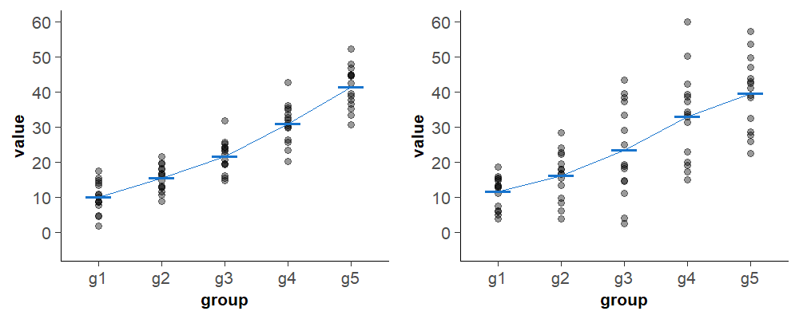
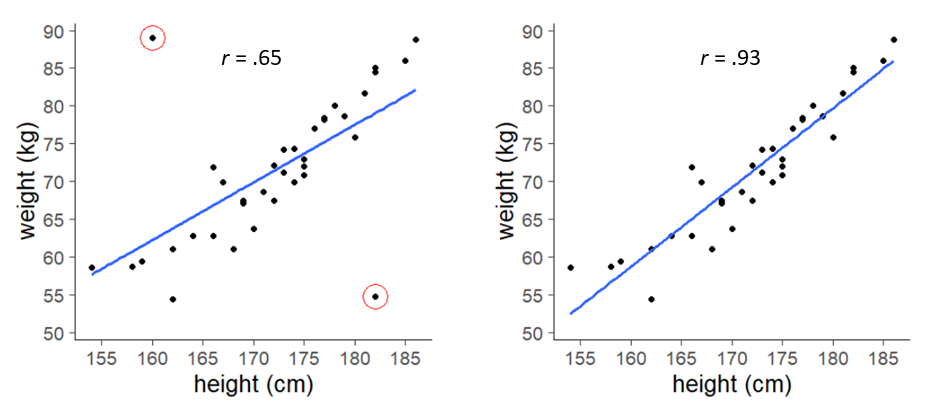

<base target = "_blank">

<style>
p.caption {
  font-size: 0.85em;
}
</style>

```{r setup, include = FALSE}

library(learnr)
library(gradethis)
library(tidyverse)

df <- read.csv("data/tutorial_data.csv")

# tutorial options
tutorial_options(
  # globally disable code completion
  exercise.completion = FALSE,
  # code running in exercise times out after 2 min
  exercise.timelimit = 120,
  # use gradethis for checking
  exercise.checker = gradethis::grade_learnr
  )

# hide non-exercise code chunks
knitr::opts_chunk$set(echo = FALSE)

```


<a rel="license" href="http://creativecommons.org/licenses/by-nc-sa/4.0/"></a> This tutorial was created by Nuria Doñamayor and Lara Wieland, and is licensed under a <a rel="license" href="http://creativecommons.org/licenses/by-nc-sa/4.0/">Creative Commons Attribution-NonCommercial-ShareAlike 4.0 International License</a>.


## Optional tutorial: Assumptions of parametric tests

Welcome to our optional tutorial on parametric assumptions!

We're glad to have piqued your interest about assumptions in the <span style = "color:#008080">***Intro to R***</span> tutorial! In this tutorial we are going to review parametric assumptions in general and then go a bit more into detail for both tests you're already familiar with: correlation and t-test.

  
###

  
### Learning goals

1. Understand the importance of assumptions
2. Learn how to test for assumptions
3. Get acquainted with alternative tests when parametric assumptions are not met


### How to use this tutorial

Given that you've already gone through our <span style = "color:#008080">***Intro to R***</span> tutorial, you're probably already quite familiar with the tutorial structure. So let's just do a brief recap. 

As you know, all tutorials in this course are conceived so you can go though them on your own and set your own learning pace. Every subsection will start with some introductory information about the topic at hand, in which you'll occasionally encounter [links](https://techterms.com/definition/hyperlink) with extra info, reminders of basic concepts or notions of computing and coding. As before, you might not need to go through every single linked page in depth, but they can help you out in case of need. 

<div class = "exercise_instruction"> 

Once again, coding exercises will be preceded by brief instructions, which we have highlighted by using a different font and color from the rest of the text. 

</div> 

```{r fig1, echo = FALSE, out.width = "80%", fig.align = "center"}

knitr::include_graphics("images/code_chunk.png")

```

Most of the time, the exercises will contain pre-populated code with blanks that you need to fill in. Once you're done, you can "run" the code and see your results. Some of the exercises also include hints and/or have a specific correct answer, in which case you'll see those additional buttons. 

<div class = "hot_tip">

**TIP**

This tutorial also contains tips that might come in handy.

</div>

<p></p>

Finally, there will also be a short quiz or two so you can test your newly or not-so-newly acquired knowledge. 

```{r how-to-question}

question(

  "Don't you find quizzes great to consolidate what you just learned?",

  answer("Of course I do!", correct = TRUE),
  answer("Quizzes disgust me!"),

  allow_retry = TRUE,
  random_answer_order = TRUE,
  
  correct = "Lovely, let's go!",
  incorrect = "Oh, no! We'll hopefully show your they're a great way to get you to reflect on what you just learned!"

)

```

That's it!


## What are assumptions in parametric testing?

Parametric tests require data to comply with certain assumptions regarding e.g. the shape of the sampling distribution, their variance or their level of measurement. If your data do not comply with these assumptions and you still choose to use a parametric test, your results might be inaccurate. Therefore, it is essential to check the assumptions before running any parametric test and consider the alternatives in case your data violate any of them.

Most parametric tests are based on the normal distribution and have four basic assumptions that must be met to deliver accurate results:

1. At least [interval level](https://dictionary.apa.org/measurement-scale) data
2. Independent data
3. Normal (Gaussian) sampling distribution
4. Homogeneity of variance (homoscedasticity)

While the first assumption should be clear enough, let's go a bit more into detail about the rest.


### 


### The assumption of independence

This assumption means slightly different things depending on the test at hand. 

Let's take t-tests or analyses of variance (ANOVA) to begin with. In between-subjects designs, it simply means that each participant's scores is not influenced by another participant's scores. But think about within-subject designs (also called repeated-measures designs), e.g. if you measure participants' behavior in a certain task at two points in time. Obviously, scores that come from the same participant are inherently not independent. Well, these tests still assume that the behavior of each participant is independent from the behavior of the other participants. However, repeated-measures tests do make some adjustments to their formulas in order to account for the intrinsic dependence between scores from the same participant.

Why did we say then that the assumption of independence differs between tests? Well, e.g. in regression analysis independence not only refers to the influence of one participant on the other, it also refers to the fact that the residual terms (or errors) for any two observations should be uncorrelated. So it's a good idea to check what this assumption means for the test you plan to use.

```{r fig2, echo = FALSE, out.width = "45%", fig.align = "center", fig.cap = "The exam cheat (via [makeagif.com](https://makeagif.com/gif/mr-bean-the-exam-cheat-2h7b7a))"}

knitr::include_graphics("https://i.makeagif.com/media/4-05-2015/2h7b7a.gif")

```


### The assumption of normality

Most parametric tests assume that the sampling distribution of your statistic is normally distributed. Yes, you read right, the **sampling distribution**, not the data themselves. Take the arithmetic mean as an example: what this means is that, if you take a sample of a few subjects and calculate the sample mean of your measure of interest and repeat this with multiple samples, the distribution of these sample means (called the *sample distribution of the mean*) will be normally distributed. But how do you know this holds for your data? Because, let's face it, its hard enough to get hold of a medium subject sample, let alone thousands of similar samples to check the sampling distribution of your statistic...

Well, thanks to the [central limit theorem](https://dictionary.apa.org/central-limit-theorem) we know that, as long as your sample size isn't minuscule, the sample distribution of your statistic of interest will be approximately normal, irrespective of what the distribution of the population looks like. You can see this depicted in Figure 3 of [this paper](https://doi.org/10.1038/nmeth.2613) by Krzywinski and Altman (2013).

In that case, why fuss about checking whether your sample data is normally distributed? Why have statisticians even bothered developing tests that don't rely on these parametric assumptions? 

[Danielle Navarro](https://djnavarro.net/) offers an excellent example in [her book](https://learningstatisticswithr.com). If you believe that your outcome variable results from the average of a bunch of different factors (e.g. IQ), chances are it will be normally distributed, independently of the distribution of your sample data. However, if you believe that your outcome variable may be triggered by several different processes and takes place whenever one of those processes first occurs (e.g. reaction times; though, as she notes, this is a massive oversimplification of reaction times), chances are it will be systematically non-normally distributed. But still, there is obviously no guarantee in either direction!

Nice thing about the central limit theorem though, it also tells us that if the sample data are approximately normally distributed, then the sampling distribution will also be normal. So that is why you should always check whether your sample data are normally distributed and choose your statistical procedure accordingly.


### The assumption of homogeneity of variance

Most parametric tests assume that the variances of your data are roughly the same (homoscedasticity). When testing several groups, this means that they come from populations with similar variances. In correlation, homogeneity of variance implies that the variance of one variable should be stable at all levels of the other variable. 

```{r fig3, echo = FALSE, out.width = "80%", fig.align = "center", fig.cap = "Data with homogeneous (left) and heterogeneous (right) variances"}



```


## Correlation

We covered correlation in our <span style = "color:#008080">***Intro to R***</span> tutorial, where you used Pearson's *r* correlation coefficient to test whether the scores from the [BDI-II](https://naviauxlab.ucsd.edu/wp-content/uploads/2020/09/BDI21.pdf) and the [PDI](https://academic.oup.com/schizophreniabulletin/article/30/4/1005/1930847) were related. 

As a brief reminder, the correlation coefficient quantifies the **linear relationship** between two variables. Correlation coefficients range from −1 to +1, where ±1 indicates the strongest possible linear relationship and 0 a lack of relationship.

```{r fig4, echo = FALSE, out.width = "55%", fig.align = "center", fig.cap = "Illustration from [Hadley Wickham's](https://hadley.nz/) ACM talk [The Joy of Functional Programming (for Data Science)](https://learning.acm.org/techtalks/functionalprogramming) by [Allison Horst](https://twitter.com/allison_horst), licensed under [CC BY 4.0](https://creativecommons.org/licenses/by/4.0/)"}

knitr::include_graphics("https://cdn.myportfolio.com/45214904-6a61-4e23-98d6-b140f8654a40/1cf11f57-5d06-43bf-8916-d4a79465a758_rw_1920.png?h=314479e61fcb66dbe0059dbde36d3610")

```


### 


### Assumptions of Pearson's correlation coefficient

Pearson's correlation coefficient is parametric and, as such, in order to apply it to your data, the following assumptions need to hold true:

1. Data must be at least **interval level**
2. Data must be independent but **paired**, i.e. each participant must have a value in each variable, but each participant's values must be independent from the other participants' values
3. The sampling distribution of the test statistic must be **normal** 

A final thing we haven't mentioned till now is that the data should contain **no outliers**. 


###

Take a look at these two graphs:

```{r fig5, echo = FALSE, out.width = "100%", fig.align = "center", fig.cap = "Scatterplots, Pearson's correlation coefficients and regression lines for data with and without outliers"}



```

As you can see, the two highlighted outliers have a major influence on the correlation coefficient. You can also see this graphically depicted by the angle of the regression line.


### Testing for assumptions

After all this theory, let's get down to some practice. You are going to take a look at the data from the probabilistic reversal task ([here](https://www.jneurosci.org/content/jneuro/22/11/4563) you can find a paper describing a similar task) from the simulated dataset you looked at in the <span style = "color:#008080">***Intro to R***</span> tutorial. 

<div class = "exercise_instruction"> 
  
Print the dataset to take a look at it again.
  
</div>

```{r view-dataframe, exercise = TRUE, exercise.lines = 2}

df

```


### 

As you probably guessed, for these analyses you are going to use the last two columns, i.e. the number of achieved reversal stages (revNum) and reaction times (revRT). Assumptions 1 and 2 are a given, so let's start by checking whether your data contain outliers.

You can define outliers in several different ways, but probably the most common (at least in the field of Psychology) is to consider any value above or below 3 standard deviations from the mean as an outlier. To find potential outliers, you simply need to transform your values to [*z*-scores](https://dictionary.apa.org/z-score), find those greater than ±3 and deal with them. 

There are basically three main things you can do with outliers:

- Remove the outlier case
- Transform the data (all the data, not just the outlier case)
- Change the value of the outlier case (obviously in a prespecified way, not just by some value you fancy)

For simplicity's sake, if you find any outliers in your data, you'll just remove the cases.

<div class = "exercise_instruction"> 
  
Run the code to check if you have any <span class = "exercise_instruction_nonitalicized">z</span>-scores greater than ±3 in your two variables of interest. 
  
</div>

```{r outliers-reversal, exercise = TRUE, exercise.lines = 8}

df %>% 
  # select the variables of interest
  select(revNum, revRT) %>% 
  # remove the rows with all NA data
  drop_na() %>% 
  # the function scale() transforms your values to z-scores
  scale()

```

<div class = "hot_tip">
      
**TIP**
      
You probably recognize the "pipe" operator **`%>%`** from the Intro to R tutorial. Remember, it is used to forward a value or the result of an expression into the next function call or expression. 

</div>


###

As you can see, you have no values above +3 or below -3 in either variable, so your data can stay as is. 

Let's dive into checking the assumption of normality.

<div class = "exercise_instruction"> 
  
Start by looking at the number of achieved reversal stages using a histogram.
  
</div>

```{r plot-hist-revNum, exercise = TRUE, exercise.lines = 11, warning = FALSE}

# note how you only need to input data for the x-axis for a histogram
ggplot(df, aes(x = revNum)) +
  # plot density instead of count in the y-axis, so you can later overlay the bell curve
  geom_histogram(aes(y = ..density..), binwidth = 1, colour = "black", fill = "steelblue2") +
  # plot the normal curve over the histogram
  stat_function(fun = dnorm, 
                args = list(mean = mean(df$revNum, na.rm = TRUE), sd = sd(df$revNum, na.rm = TRUE)), 
                color = "darkred", size = 1.5) +
  # add a meaningful label to the x-axis
  labs(x = "number of reversals")
  
```

<div class = "hot_tip">

**TIP**

Read the comments in the code to understand what it does. From here on out you will also want to use the comments to know how to fill in the blanks.

</div>


### 

<div class = "exercise_instruction"> 
  
Can you do the same for the reaction times?
  
</div>

```{r plot-hist-revRT, exercise = TRUE, exercise.lines = 8, warning = FALSE}

ggplot(df, aes(x = ______)) +
  # note how the bin width is set to 50 (ms) in this histogram
  geom_histogram(aes(y = ..density..), binwidth = 50, colour = "black", fill = "steelblue2") +
  stat_function(fun = dnorm, 
                args = list(mean = mean(df$______, na.rm = TRUE), sd = sd(df$______, na.rm = TRUE)), 
                color = "darkred", size = 1.5) +
  labs(x = "reaction time (ms)")
  
```

```{r plot-hist-revRT-hint}

Try the variable name revRT

```
  
```{r plot-hist-revRT-solution, exercise.reveal_solution = FALSE}

ggplot(df, aes(x = revRT)) +
  geom_histogram(aes(y = ..density..), binwidth = 50, colour = "black", fill = "steelblue2") +
  stat_function(fun = dnorm, args = list(mean = mean(df$revRT, na.rm = TRUE), sd = sd(df$revRT, na.rm = TRUE)), color = "darkred", size = 1.5) +
  labs(x = "reaction time (ms)")

```

```{r plot-hist-revRT-check}

grade_code("Great plotting job!")

```


<div class = "hot_tip">

**TIP**
      
Remember that you can click on 'Hints' if you need some help!
    
</div>


### 

```{r plot-hist-normal-question}

question(

  "Based on the histograms you just plotted, are your data normally distributed?",
  
  answer("I can't really be sure from those plots", correct = TRUE),
  answer("The number of achieved reversal stages is normally distributed, but the reaction times are not"),
  answer("The reaction times are normally distributed, but the number of achieved reversal stages is not"),
  answer("Both variables are normally distributed"),
  answer("Neither variable is normally distributed"),
  
  allow_retry = TRUE,
  random_answer_order = TRUE,
  
  correct = "Exactly, it's really hard to tell from just a histogram!",
  incorrect = "Not quite right! Try again!"
  
)

```


### 

Another potentially useful graph to explore whether data are normally distributed are so-called **[Q-Q plots](https://dictionary.apa.org/quantile-quantile-plot)** (Q-Q stands for quantile–quantile). These plot the cumulative values in your data against the cumulative probability of the normal distribution. This is done on ranked and sorted data. If the data are normal, they'll fall on the diagonal. The more your data deviate from the diagonal, the more their distribution deviates from normality.

<div class = "exercise_instruction"> 
  
Fill in the blank and run this code to obtain the Q-Q plots.
  
</div>

```{r plot-qq-reversal, exercise = TRUE, exercise.lines = 12, warning = FALSE}

# Q-Q plot for the number of reversals
ggplot(df, aes(sample = revNum)) +
  stat_qq() +
  stat_qq_line() +
  labs(y = "sample (revNum)")

# Q-Q plot for reaction times
ggplot(df, aes(sample = ______)) +
  stat_qq() +
  stat_qq_line() +
  labs(y = "sample (revRT)")
  
```


### 

Is this output a bit clearer? Well, the number of achieved reversals appears to be clearly not normally distributed, but in the case of reaction times most of the points are quite close to the diagonal while the extremes are quite far away. But how close is close enough and vice versa?

As usual, looking at some actual numbers is going to be the way to go. There are two main tests that can be used to check whether your data are normally distributed: Kolmogorov-Smirnov and Shapiro-Wilk. Both tests take normality as the [null hypothesis](https://dictionary.apa.org/null-hypothesis), i.e. your data are normally distributed if the test is *not significant*.

The **Kolmogorov-Smirnov test** is a more general test that can be used to compare sample data to a probability distribution (normal or many others). The **Shapiro-Wilk test** is a specific test for normality and more powerful than Kolmogorov-Smirnov, meaning that it correctly rejects the null hypothesis of normality more often (i.e. it will *correctly* tell you that your data is not normally distributed more often). 

You can run the Shapiro-Wilk test with the function **`shapiro.test()`**, which takes a vector of numeric values as a single argument.

<div class = "exercise_instruction"> 
  
Run the Shapiro-Wilk test on your variables of interest.
  
</div>

```{r shapiro-wilk-reversal, exercise = TRUE, exercise.lines = 4}

shapiro.test(df$______)

shapiro.test(df$______)

```

```{r shapiro-wilk-reversal-hint}

Remember that your variables are named revNum and revRT

```

```{r shapiro-wilk-reversal-solution, exercise.reveal_solution = FALSE}

shapiro.test(df$revNum)

shapiro.test(df$revRT)

```

```{r shapiro-wilk-reversal-check}

grade_code("")

```


###

```{r shapiro-wilk-reversal-question}

question(

  "What do the Shapiro-Wilk tests tell us? (choose all correct answers)",

  answer("The distribution of the number of achieved reversal stages differs significantly from a normal distribution (is not normally distributed)", correct = TRUE),
  answer("The distribution of the reaction times does not differ significantly from a normal distribution (is normally distributed)", correct = TRUE),
  answer("The distribution of the number of achieved reversal stages does not differ significantly from a normal distribution (is normally distributed)"),
  answer("The distribution of the reaction times differs significantly from a normal distribution (is not normally distributed)"),
  
  allow_retry = TRUE,
  random_answer_order = TRUE,
  
  correct = "Great job understanding the output of the Shapiro-Wilk test!",
  incorrect = "Not quite right! Try again!"

)

```


### Alternatives to Pearson's correlation coefficient when assumptions are not met

Since your data do not conform to parametric assumptions, we are going to introduce two non-parametric correlation coefficients: Spearman’s *ρ* (rho) and Kendall’s *τ* (tau). 

**Spearman’s *ρ* **simply ranks the data (i.e. sorts them and gives them the value of their sorted position) and then applies Pearson's equation to the ranks. Spearman’s *ρ* is also commonly abbreviated as *r~s~*, which is a good idea, since *ρ* can be hard to tell apart from *p* at first sight.

**Kendall’s *τ* **is preferred to Spearman’s *ρ* when the dataset is small and there is a large number of tied ranks (i.e. identical ranks). Kendall’s *τ* doesn't use Pearson's equation, but is based on the number of concordant (with the same rank) and discordant (with different ranks) pairs.

The good news is that both non-parametric alternatives to Pearson's correlation coefficient are also implemented in the **`cor.test()`** function, so you just need to set the option `method = "spearman"` or `method = "kendall"`. Also, both non-parametric correlation coefficients range from −1 to +1, and are interpreted just like Pearson's, with ±1 indicating the strongest possible relationship and 0 a lack of relationship.


###

<div class = "exercise_instruction"> 
  
Let's start by looking at the data using a scatterplot, which you haven't done yet. Plot the reaction time (y-axis) against the number of achieved reversals (x-axis).
  
</div>

```{r num-rt-scatterplot, exercise = TRUE, exercise.lines = 4, warning = FALSE}

ggplot(data = df, aes(x = ______, y = ______)) +
  geom_point(size = 2) +
  labs(x = "number of achieved reversals", y = "reaction time (ms)")

```

```{r num-rt-scatterplot-solution, exercise.reveal_solution = FALSE}

ggplot(data = df, aes(x = revNum, y = revRT)) +
  geom_point(size = 2) +
  labs(x = "number of achieved reversals", y = "reaction time (ms)")

```

```{r num-rt-scatterplot-check}

grade_code("")

```


###

As you can see by looking at the x-axis, there are almost always several participants who achieved the same number of reversals. This means your dataset is going to have a lot of tied ranks, so that Kendall’s *τ* will be the most appropriate correlation coefficient to apply. Let's go ahead and do this.


###

<div class = "exercise_instruction"> 
  
Calculate Kendall's correlation coefficient in order to formally test for the relationship between the number of achieved reversals and the reaction time.
  
</div>

```{r num-rt-kendall, exercise = TRUE, exercise.lines = 2, warning = FALSE}

cor.test(df$revNum, df$revRT, method = "______")

```

```{r num-rt-kendall-hint}

Try method = "kendall"

```
  
```{r num-rt-kendall-solution, exercise.reveal_solution = FALSE}

cor.test(df$revNum, df$revRT, method = "kendall")

```

```{r num-rt-kendall-check}

grade_code("Well done calculating Kendall’s *τ*!")

```


###

```{r num-rt-kendall-question}

question(

  "What does the correlation tell us?",

  answer("The p-value is smaller than 0.05 and the tau-value is 0.21, meaning there is a significant, very weak correlation between number of achieved reversals and reaction time", correct = TRUE),
  answer("The p-value is smaller than 0.1 and the tau-value is 0.21, meaning there is a significant, moderate negative correlation between number of achieved reversals and reaction time"),
  answer("The p-value is larger than 0.05 and the tau-value is 0.21, meaning there is no significant correlation between number of achieved reversals and reaction time"),
  answer("The p-value is larger than 0.1 and the tau-value is 0.21, meaning there is a significant, weak correlation between number of achieved reversals and reaction time"),
  
  allow_retry = TRUE,
  random_answer_order = TRUE,
  
  correct = "Great job understanding Kendall’s *τ*!",
  incorrect = "Not quite right! Try again!"
  
)

```


## T-test

In the <span style = "color:#008080">***Intro to R***</span> tutorial, you used a t-test to analyze whether there were differences in [AUDIT](https://www.who.int/publications/i/item/WHO-MSD-MSB-01.6a) score depending on gender.

As a brief reminder, the independent t-test is used to determine whether the means of two groups differ significantly, whereas the dependent t-test is used to examine whether the means of two variables from the same group differ significantly.

```{r fig6, echo = FALSE, out.width = "75%", fig.align = "center", fig.cap = "Artwork by [@allison_horst](https://twitter.com/allison_horst), licensed under [CC BY 4.0](https://creativecommons.org/licenses/by/4.0/) (modified)"}


```


### 


### Assumptions of the t-test

Both the independent t-test and the dependent t-test are parametric and, as such, require the following to be true:

1. Data must be at least **interval level**
2. Data must be **independent**
3. The sampling distribution of the test statistic must be **normal**
4. In case of the independent t-test, variances must be **homogeneous**

Finally, you should always check your data for **outliers**. This is quite critical in case of using any test based on means (such as the t-test), since the arithmetic mean is not robust against outliers, i.e. it is heavily influenced by extreme values.


### Testing for assumptions

For the t-test, you are going to take a look at the reaction time data from the probabilistic reversal task. Similar to the <span style = "color:#008080">***Intro to R***</span> tutorial, you are going to compare the reaction times based on a grouping variable, in this case whether participants were patients or healthy controls.  

Once again, let's start by looking at whether you have outliers in your data. Just as you checked for both variables separately before doing the correlation, you need to look at both groups separately in this case too.

<div class = "exercise_instruction"> 
  
Fill in the blanks and run the code to check if you have any <span class = "exercise_instruction_nonitalicized">z</span>-scores greater than ±3 in your groups.
  
</div>

```{r outliers-groups, exercise = TRUE, exercise.lines = 17}

# start with the patient group
df %>% 
  filter(group == "PAT") %>% 
  select(revRT) %>% 
  drop_na() %>% 
  scale() %>% 
  # sort your z-values from smallest to largest, so it's easier to find extreme values
  sort()

# followed by the control group
df %>% 
  filter(group == "______") %>% 
  select(______) %>% 
  drop_na() %>% 
  scale() %>% 
  sort()

```

```{r outliers-groups-hint-1}

Remember that your groups are named "PAT" (patients) and "HC" (healthy controls)

```

```{r outliers-groups-hint-2}

This time, you are only going to test the variable revRT

```

```{r outliers-groups-solution, exercise.reveal_solution = FALSE}

df %>% 
  filter(group == "PAT") %>% 
  select(revRT) %>% 
  drop_na() %>% 
  scale() %>% 
  sort()

df %>% 
  filter(group == "HC") %>% 
  select(revRT) %>% 
  drop_na() %>% 
  scale() %>% 
  sort()

```

```{r outliers-groups-check}

grade_code("")

```


###

As you can see, there are no outliers in either group, so let's go ahead and check the assumption of normality.

<div class = "exercise_instruction"> 
  
Let's start once again by taking a look at the Q-Q plots for each group. Note how you're using the pipe operator to filter your data within the code for the plot.
  
</div>

```{r plot-qq-revRT, exercise = TRUE, exercise.lines = 12, warning = FALSE}

# Q-Q plot for the patient group
ggplot(df %>% filter(group == "PAT"), aes(sample = revRT)) +
  stat_qq() +
  stat_qq_line() +
  labs(y = "sample (PAT)")

# Q-Q plot for the control group
ggplot(df %>% filter(group == "HC"), aes(sample = revRT)) +
  stat_qq() +
  stat_qq_line() +
  labs(y = "sample (HC)")
  
```


### 

It seems that at least the data from the patient group could be non-normal, doesn't it? Let's now get some numbers to get a clear answer for both groups.

<div class = "exercise_instruction"> 
  
Run the Shapiro-Wilk test on your variable of interest separately for each group.
  
</div>

```{r shapiro-wilk-group, exercise = TRUE, exercise.lines = 4}

shapiro.test(df$revRT[df$group == "______"])

shapiro.test(df$revRT[df$group == "______"])

```

```{r shapiro-wilk-group-solution, exercise.reveal_solution = FALSE}

# order1 ----
shapiro.test(df$revRT[df$group == "PAT"])
shapiro.test(df$revRT[df$group == "HC"])

# order2 ----
shapiro.test(df$revRT[df$group == "HC"])
shapiro.test(df$revRT[df$group == "PAT"])

```

```{r shapiro-wilk-group-check}

grade_this({
  
  pass_if_equal(.solution_all, "Great job!")
  
  fail(hint = TRUE)
  
})

```

<div class = "hot_tip">

**TIP**

In R, there are are multiple ways of filtering a variable from your dataset (or your whole dataset) based on a condition from another variable. 

In the exercise above you are using **base code**:

`df$variable1[df$variable2 == value]`

This expression returns a **vector** of values, which is the input required by certain functions, like e.g. `shapiro.test()`.

You can obtain the same values using **tidyverse code**, as you have done in most exercises:

`df %>% filter(variable2 == value) %>% select(variable1)`

However, with this code, the output structure will be of the same type as that of the input, in this case a **data frame**. 

Some functions can only deal with specific types of structures, so you should be aware of different options available for data wrangling.

</div>


###

```{r shapiro-wilk-group-question}

question(
  
  "What do the Shapiro-Wilk tests tell us? (choose all correct answers)",
  
  answer("The distribution of the reaction times of the patient group differs significantly from a normal distribution (is not normally distributed)", correct = TRUE),
  answer("The distribution of the reaction times of the control group does not differ significantly from a normal distribution (is normally distributed)", correct = TRUE),
  answer("The distribution of the reaction times of the patient group does not differ significantly from a normal distribution (is normally distributed)"),
  answer("The distribution of the reaction times of the control group differs significantly from a normal distribution (is not normally distributed)"),
  
  allow_retry = TRUE,
  random_answer_order = TRUE,
  
  correct = "Great job understanding the output of the Shapiro-Wilk test!",
  incorrect = "Not quite right! Try again!"

)

```


###

Fantastic, you're now ready to learn about non-parametric alternatives to the t-test! 

But wait, you're probably thinking we forgot about the assumption of homoscedasticity! We did not. 

You can use [**Levene's test**](https://datatab.net/tutorial/levene-test) to explore whether variances are equal, e.g. as implemented in the function **`leveneTest()`** from the package **car**. When using a t-test, you could then set the option `var.equal = TRUE` or `var.equal = FALSE` depending on your result. 

However, if your data conform to the rest of the parametric assumptions and you are going to use an independent t-test, you'd be better advised to just leave the default options implemented in the function `t.test()`. Why is this? You might (or might not) have noticed that the output of the t-test in the <span style = "color:#008080">***Intro to R***</span> tutorial was labeled *Welch Two Sample t-test*. [Welch's adaptation](https://en.wikipedia.org/wiki/Welch%27s_t-test) of [Student's t-test](https://en.wikipedia.org/wiki/Student%27s_t-test) performs better when variances and sample sizes are not equal, and as well as Student's when variances and sample sizes are equal. So you can just sit back and take advantage that Welch's, and not Student's, t-test is the default in R.


### Alternatives to the t-test when assumptions are not met

Since your data do not conform to parametric assumptions, we are going to introduce the non-parametric alternative to the independent t-test: the Mann–Whitney or Wilcoxon rank-sum test (not to be confused with the Wilcoxon *signed-rank* test, which is the non-parametric alternative to the *dependent* t-test). 

The **Wilcoxon rank-sum test** basically ranks all the data from your dependent variable, irrespective of their group, and then compares the summed ranks of the groups. The test statistic in this case is called *W*.

This test is implemented in the **`wilcox.test()`** function, which takes similar arguments as the `t.test()` function. Similarly, both functions can be used for paired data just by setting the option `paired = TRUE`.


###

<div class = "exercise_instruction"> 
  
Let's start by looking at the data using a violin plot with overlaid summary statistics for your data, just as you did in the previous tutorial.
  
</div>

```{r group-revRT-violinplot, exercise = TRUE, exercise.lines = 8, warning = FALSE}

ggplot(data = df, aes(x = group, y = revRT)) +
  geom_violin() +
  # add points to show the mean
  stat_summary(fun = mean, geom = "point", size = 2) +
  # add error bars to show the standard error of the mean
  stat_summary(fun.data = mean_se, geom = "errorbar", width = .13) +
  labs(y = "reaction time (ms)")

```


###

<div class = "exercise_instruction"> 
  
Calculate a Wilcoxon rank-sum test in order to formally test for differences in reaction times between groups.
  
</div>

```{r group-revRT-wilcoxtest, exercise = TRUE, exercise.lines = 4, warning = FALSE}

# the wilcox.test function takes the form wilcox.test(dependent variable ~ independent variable, options), 
# just like the t.test function
wilcox.test(df$______ ~ df$______, paired = FALSE)

```

```{r group-revRT-wilcoxtest-hint}

Try the variable names revRT and group

```

```{r group-revRT-wilcoxtest-solution, exercise.reveal_solution = FALSE}

wilcox.test(df$revRT ~ df$group, paired = FALSE)

```

```{r group-revRT-wilcoxtest-check}

grade_code("Well done calculating the Wilcoxon rank-sum test!")

```


###

```{r group-revRT-question}

question(
  
  "What do the Wilcoxon rank-sum test and the violin plot tell us?",
  
  answer("The p-value is smaller than 0.05, meaning patients' (PAT) reaction times were significantly slower than healthy controls' (HC)", correct = TRUE),
  answer("The p-value is larger than 0.01, meaning healthy controls' (HC) reaction times were significantly faster than patients' (PAT)"),
  answer("The p-value is larger than 0.05, meaning healthy controls' (HC) and patients' (PAT) reaction times were equally slow"),
  answer("The p-value is smaller than 0.01, meaning patients' (PAT) and healthy controls' (HC) reaction times were equally fast"),
  
  allow_retry = TRUE,
  random_answer_order = TRUE,
  
  correct = "Bravo on understanding the Wilcoxon rank-sum results!",
  incorrect = "Not quite right! Try again!"

)

```


## Wrap-up

That was the optional tutorial on parametric assumptions! 

You have now become acquainted with parametric assumptions, how to check them and non-parametric alternatives to parametric correlation and t-test. We hope you had fun and learned loads!

<div style = "text-align: right; font-size: 1.2em; font-family: Indie Flower;">This tutorial was created by [Dr.rer.nat. Nuria Doñamayor](https://scholar.google.com/citations?user=MFJ3j-YAAAAJ&hl=es&oi=ao) & [M.Sc. Lara Wieland](https://scholar.google.com/citations?user=PB8KgtYAAAAJ&hl=es&oi=ao) ([AG Lernen und Kognition](https://psychiatrie-psychotherapie.charite.de/forschung/computational_neuroimaging/ag_lernen_und_kognition/))</div>

