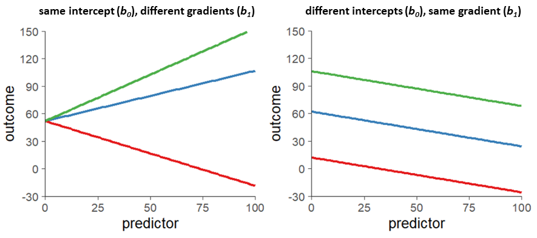

<base target = "_blank">

<style>
p.caption {
  font-size: 0.85em;
}
</style>

```{r setup, include = FALSE}

library(learnr)
library(gradethis)
library(tidyverse)

df <- read.csv("data/tutorial_data.csv")

# tutorial options
tutorial_options(
  # globally disable code completion
  exercise.completion = FALSE,
  # code running in exercise times out after 2 min
  exercise.timelimit = 120,
  # use gradethis for checking
  exercise.checker = gradethis::grade_learnr
  )

# hide non-exercise code chunks
knitr::opts_chunk$set(echo = FALSE)
```


<a rel="license" href="http://creativecommons.org/licenses/by-nc-sa/4.0/"></a> This tutorial was created by Nuria Doñamayor and Lara Wieland, and is licensed under a <a rel="license" href="http://creativecommons.org/licenses/by-nc-sa/4.0/">Creative Commons Attribution-NonCommercial-ShareAlike 4.0 International License</a>.


## Optional tutorial: Statistical tests as linear models

Welcome to our optional tutorial on statistical tests as linear models!

We're pleased to have aroused your curiosity about linear models in the <span style = "color:#008080">***Intro to R***</span> tutorial! In this tutorial we are going to talk a bit about how common statistical tests are linear models and take a closer look at both tests you're already familiar with: correlation and t-test.

  
###

  
### Learning goals

1. Understand the concept of linear models
2. Understand that common statistical tests are linear models


### How to use this tutorial

Given that you've already gone through our <span style = "color:#008080">***Intro to R***</span> tutorial, you're probably already quite familiar with the tutorial structure. So let's just do a brief recap. 

As you know, all tutorials in this course are conceived so you can go though them on your own and set your own learning pace. Every subsection will start with some introductory information about the topic at hand, in which you'll occasionally encounter [links](https://techterms.com/definition/hyperlink) with extra info, reminders of basic concepts or notions of computing and coding. As before, you might not need to go through every single linked page in depth, but they can help you out in case of need. 

<div class = "exercise_instruction"> 

Once again, coding exercises will be preceded by brief instructions, which we have highlighted by using a different font and color from the rest of the text. 

</div> 

```{r fig1, echo = FALSE, out.width = "80%", fig.align = "center"}

knitr::include_graphics("images/code_chunk.png")

```

Most of the time, the exercises will contain pre-populated code with blanks that you need to fill in. Once you're done, you can "run" the code and see your results. Some of the exercises also include hints and/or have a specific correct answer, in which case you'll see those additional buttons. 

<div class = "hot_tip">

**TIP**

This tutorial also contains tips that might come in handy.

</div>

<p></p>

Finally, there will also be a short quiz or two so you can test your newly or not-so-newly acquired knowledge. 

```{r how-to-question}

question(
  
  "Don't you find quizzes great to consolidate what you just learned?",
  
  answer("Of course I do!", correct = TRUE),
  answer("Quizzes disgust me!"),
  
  allow_retry = TRUE,
  random_answer_order = TRUE,

  correct = "Lovely, let's go!",
  incorrect = "Oh, no! We'll hopefully show your they're a great way to get you to reflect on what you just learned!"

)
```

That's it!


## What is a linear model?

Put as simply as it gets, a linear model is just a model that attempts to explain the data using a straight line. 

The first thing that comes to mind is therefore probably something like this:

```{r fig2, echo = FALSE, out.width = "55%", fig.align = "center", fig.cap = "Example of linear regression ([original](https://en.wikipedia.org/wiki/Linear_regression#/media/File:Linear_regression.svg) licensed under [CC0](https://creativecommons.org/share-your-work/public-domain/cc0/))"}

knitr::include_graphics("https://upload.wikimedia.org/wikipedia/commons/3/3a/Linear_regression.svg")

```

Indeed, that is the graphical depiction of a simple linear regression, probably the most well known of linear models. There are obviously other linear models, such as [multiple linear regression analysis](https://dictionary.apa.org/multiple-regression) or [generalized linear models](https://dictionary.apa.org/generalized-linear-model), but we'll stick to simple regression for this tutorial. 


### 


### What does simple linear regression do? 

Simple regression attempts to predict the values in the [dependent variable](https://dictionary.apa.org/dependent-variable) or outcome (called *regressand* in regression) from *one* [independent variable](https://dictionary.apa.org/independent-variable) (called *predictor* in regression). In order to do this, as you can imagine, it uses a straight line, which can be defined by two parameters:

- **Intercept**: the value at which the line crosses X = 0
- **Slope**: the gradient (inclination) of the line

Any statistical model also includes an error or **residual** term, which represents the difference between the model's prediction and the measured value.

Mathematically, simple linear regression is expressed as:

$Y_{i} = b_{0} + b_{1}X_{i} + \epsilon_{i}$,

where $Y_{i}$ is the predicted value of the outcome for participant $i$, $b_{0}$ is the intercept, $b_{1}$ is the slope, $X_{i}$ is the value of the predictor for participant $i$, and $\epsilon_{i}$ is the residual term for participant $i$. 

If you omit the residual term, the equation should look quite familiar, since it pretty much just boils down to the $y = ax + b$ you know from school.

```{r fig3, echo = FALSE, out.width = "90%", fig.align = "center", fig.cap = "Regression lines with intercept and gradient variations"}



```


### Fitting a line to the data 

Linear regression uses the method of [**ordinary least squares**](https://en.wikipedia.org/wiki/Ordinary_least_squares) (OLS). Without getting into any further equations, OLS aims to yield the solution that results in the smallest possible sum of the squared differences between the predicted and observed values of the regressand.

Let's look at this graphically:

```{r fig4, echo = FALSE, out.width = "50%", fig.align = "center", fig.cap = "Scatterplot with regression lines and dotted lines representing the residuals"}


```

So, basically, what OLS regression does is find the line that minimizes the sum of the squared distance represented by the green dotted lines in the graph. This so-called **residual sum of squares** (for the example plot above, *SS~R~* = 10.20) can be interpreted as the degree of inaccuracy when the best simple regression model is fitted to the data.


### 

This is a good time to think about [**outliers**](https://dictionary.apa.org/outlier), i.e. extreme observations that differ from the rest of the observations. We have introduced a new observation to our example plot, marked in red:

```{r fig5, echo = FALSE, out.width = "50%", fig.align = "center", fig.cap = "Scatterplot with regression lines, dotted lines representing the residuals and outlier"}


```

As you can see, this new observation has drastically changed the position of the regression line, since it has now been "pulled" towards the outlier. The green dotted lines are  now also longer, increasing the residual sum of squares (now, *SS~R~* = 44.40!) and thus the inaccuracy of the model. In conclusion, be careful with outliers in your data!


## Correlation as a linear model

We covered correlation in our <span style = "color:#008080">***Intro to R***</span> tutorial, where you used Pearson's *r* correlation coefficient to to test whether the scores from the [BDI-II](https://naviauxlab.ucsd.edu/wp-content/uploads/2020/09/BDI21.pdf) and the [PDI](https://academic.oup.com/schizophreniabulletin/article/30/4/1005/1930847) were related. 

This time, you are going to take a look at the relationship between the scores from the [PDI](https://academic.oup.com/schizophreniabulletin/article/30/4/1005/1930847) (pdi) and the [AUDIT](https://www.who.int/publications/i/item/WHO-MSD-MSB-01.6a) (audit) from the simulated dataset you looked at in the <span style = "color:#008080">***Intro to R***</span> tutorial. 

As a brief reminder, the correlation coefficient quantifies the **linear relationship** between two variables. Correlation coefficients range from −1 to +1, where ±1 indicates the strongest possible linear relationship and 0 a lack of relationship.

<div class = "exercise_instruction"> 
  
You can take a look at the dataset again here.
  
</div>

```{r view-dataframe, exercise = TRUE, exercise.lines = 2}

df

```


### 

### 

<div class = "exercise_instruction"> 
  
Start by looking at the data using a scatterplot.
  
</div>

```{r audit-pdi-scatterplot, exercise = TRUE, exercise.lines = 4, warning = FALSE}

ggplot(data = df, aes(x = audit, y = pdi)) +
  geom_point(size = 2) +
  labs(x = "AUDIT score", y = "PDI score")

```

<div class = "exercise_instruction"> 
  
Now calculate Pearson's <span class = "exercise_instruction_nonitalicized">r</span> correlation coefficient (<span class = "exercise_instruction_nonitalicized">cor</span> in the output) using the function **`cor.test()`** in order to formally test for the linear relationship between AUDIT and PDI scores.
  
</div>

```{r audit-pdi-cortest, exercise = TRUE, exercise.lines = 2}

______(df$audit, df$pdi, method = "pearson")

```

```{r audit-pdi-cortest-solution, exercise.reveal_solution = FALSE}

cor.test(df$audit, df$pdi, method = "pearson")

```

```{r audit-pdi-cortest-check}

grade_code("")

```


###

Now let's try performing a linear regression with these variables. Linear regression models the relationship between two variables by calculating the best-fitting line for the observed data using a linear equation.

<div class = "exercise_instruction"> 

Run the code to perform the linear regression.
  
</div>

```{r audit-pdi-lm, exercise = TRUE}

# the lm function takes the form lm(regressand ~ predictor, options)
summary(lm(df$pdi ~ df$audit))

```


###

The output of a linear model has a bunch of values, some of them should already be familiar from the <span style = "color:#008080">***Intro to R***</span> tutorial, but there are also a few new ones. Let's take a look at them before proceeding.

- **Residuals** are the difference between the predicted and observed values, i.e. the difference between the PDI score predicted by the model and the measured PDI score.
- Your model shows two different **estimates**:
  + The estimate of the **intercept** is the value of Y at X = 0, i.e. the predicted PDI score with an AUDIT score of 0.
  + The second estimate represents the slope of the regression line, i.e. the change in the PDI score associated with a unit change in AUDIT score.
- The **standard error of the estimate** (*Std. Error*) is a standardized measure of the distance between the predicted and observed values.
- The **residual standard error** is the average distance between the observed values of Y and the predicted values. This measure can be used to assess the [goodness of fit](https://dictionary.apa.org/goodness-of-fit) of the linear regression model.
- The **multiple *R^2^***	is a measure of the proportion of variance of the regressand accounted for by its linear relationship with the predictor, i.e. the amount of variance in PDI score explained by the AUDIT score.
- The **adjusted *R^2^*** is a normalized multiple *R^2^* that accounts for the number of samples and variables in the model.
- The ***F*-statistic** represents the amount of explained variance divided by the amount of error variance (you can read more about it [here](https://dictionary.apa.org/f-ratio)). 


###

Let's go back to practice.

<div class = "exercise_instruction"> 
  
Get the square root of the multiple R^2^.
  
</div>

```{r audit-pdi-rsquare, exercise = TRUE, exercise.lines = 2}

sqrt(______)

```

```{r audit-pdi-rsquare-solution, exercise.reveal_solution = FALSE}

sqrt(.4495)

```

```{r audit-pdi-rsquare-check}

grade_code("")

```


###

```{r audit-pdi-lm-question}

question(
  
  "How are the correlation coefficient and the simple linear regression (model) related?",
  
  answer("The square root of *R^2^* is equivalent to Pearson's *r* correlation coefficient (barring rounding errors), and the *p*-values are identical in both tests", correct = TRUE),
  answer("Not at all, they are completely different tests"),
  answer("The estimate of the intercept in the linear regression is equivalent to Pearson's *r* correlation coefficient"),
  answer("The *F*-values are identical in both tests"),
  
  allow_retry = TRUE,
  random_answer_order = TRUE,
  
  correct = "Great job understanding correlation and regression!",
  incorrect = "Not quite right! Try again!"

)

```


###

As you can see, Pearson's *r* correlation coefficient and simple linear regression give us the same results. However, be mindful, because they answer slightly different questions!

A correlation analysis *informs* about the strength and direction of the linear relationship between two variables, X and Y. A simple linear regression analysis estimates parameters in a linear equation that can be used to *predict* values of one variable, Y, based on the other, X.

Therefore, in a correlation, the X and Y variables are interchangeable, but regression attempts to predict how changes in the predictor (independent) variable X cause the regressand (dependent) variable Y to change. Swapping X and Y in a regression analysis will change the results!


###

<div class = "exercise_instruction"> 
  
Let's repeat what you jut did (X = AUDIT score, Y = PDI score) and also plot the regression line.
  
</div>

```{r audit-pdi-lm1, exercise = TRUE, exercise.lines = 13, warning = FALSE}

# correlation
cor.test(df$audit, df$pdi, method = "pearson")

# regression
summary(lm(df$pdi ~ df$audit))

# plot
ggplot(data = df, aes(x = audit, y = pdi)) +
  geom_point(size = 2) +
  # this adds the regression line
  geom_smooth(method = "lm", se = FALSE) +
  labs(x = "AUDIT score", y = "PDI score")

```


<div class = "exercise_instruction"> 
  
Now change the order of the variables (X = PDI score, Y = AUDIT score) and plot again.
  
</div>

```{r audit-pdi-lm2, exercise = TRUE, exercise.lines = 12, warning = FALSE}

# correlation
cor.test(______, ______, method = "pearson")

# regression
summary(lm(______ ~ ______))

# plot
ggplot(data = df, aes(x = ______, y = ______)) +
  geom_point(size = 2) +
  geom_smooth(method = "lm", se = FALSE) +
  labs(x = "______", y = "______")

```

```{r audit-pdi-lm2-solution, exercise.reveal_solution = FALSE}

cor.test(df$pdi, df$audit, method = "pearson")

summary(lm(df$audit ~ df$pdi))

ggplot(data = df, aes(x = pdi, y = audit)) +
  geom_point(size = 2) +
  geom_smooth(method = "lm", se = FALSE) +
  labs(x = "PDI score", y = "AUDIT score")

```

```{r audit-pdi-lm2-check}

grade_code("")

```


###

```{r audit-pdi-lm2-question}

question(
  
  "How do the results differ? (choose all correct answers)",
  
  answer("Values from the correlation analyses are identical", correct = TRUE),
  answer("All values related to the residuals and intercept from the linear regression models are different", correct = TRUE),
  answer("Estimate and its standard error are different in both linear regression models", correct = TRUE),
  answer("The regression lines have different intercepts and slopes in both graphs", correct = TRUE),
  answer("The results from the correlation analyses are different"),
  answer("Multiple and adjusted *R^2^*, and the *F*-statistics and corresponding *p*-values are different"),
  answer("Both simple regression models are identical"),
  answer("The regression lines look the same in both graphs"),
  
  allow_retry = TRUE,
  random_answer_order = TRUE,

  correct = "Exactly! So be mindful of this when using regression analyses!",
  incorrect = "Not quite right! Try again!"

)

```


## T-test as a linear model

In the <span style = "color:#008080">***Intro to R***</span> tutorial, you used a t-test to analyze whether there were differences in [AUDIT](https://www.who.int/publications/i/item/WHO-MSD-MSB-01.6a) score depending on gender.

In this tutorial, you are going to analyze the potential differences in [BDI-II](https://naviauxlab.ucsd.edu/wp-content/uploads/2020/09/BDI21.pdf) scores (bdi) between patients and healthy controls from the simulated dataset you looked at in the <span style = "color:#008080">***Intro to R***</span> tutorial. 

As a brief reminder, the independent t-test is used to determine whether the means of two groups differ significantly, whereas the dependent t-test is used to examine whether the means of two variables from the same group differ significantly.


### 

### 

To keep things simple, you are going to assume equal variances and perform a Student's t-test. If you are interested in how to calculate Welch's t-test as a linear model, check out [this link](https://lindeloev.github.io/tests-as-linear/#52_welch%E2%80%99s_t-test).

<div class = "exercise_instruction"> 
  
Start by calculating a t-test in order to formally test for differences in BDI-II scores between groups.
  
</div>

```{r bdi-group-ttest, exercise = TRUE, exercise.lines = 2}

______(df$bdi ~ df$group, paired = FALSE, var.equal = TRUE)

```

```{r bdi-group-ttest-hint}

Try the function t.test()

```

```{r bdi-group-ttest-solution, exercise.reveal_solution = FALSE}

t.test(df$bdi ~ df$group, paired = FALSE, var.equal = TRUE)

```

```{r bdi-group-ttest-check}

grade_code("")

```


<div class = "hot_tip">

**TIP**
      
Remember that you can click on 'Hints' if you need some help!
    
</div>


###

The formula of the t-test probably looks quite familiar by now, doesn't it?

<div class = "exercise_instruction"> 
  
Try writing the previous t-test as a linear model and click on <span class = "exercise_instruction_nonitalicized">'Submit answer'</span> when you're done.
  
</div>

```{r bdi-group-lm, exercise = TRUE, exercise.lines = 2}

summary(______(df$bdi ~ df$group))

```

```{r bdi-group-lm-hint}

Try the function lm()

```

```{r bdi-group-lm-solution, exercise.reveal_solution = FALSE}

summary(lm(df$bdi ~ df$group))

```

```{r bdi-group-lm-check}

grade_code("")

```


###

```{r bdi-group-lm-question}

question(
  
  "How are the t-test and the linear model related?",
  
  answer("The absolute *t*-values as well as the *p*-values (of the regressand) are identical in both tests", correct = TRUE),
  answer("Not at all, they are completely different tests."),
  answer("The standard errors of the intercept are identical in both tests"),
  answer("The multiple *R^2^* values are identical in both tests"),
  
  allow_retry = TRUE,
  random_answer_order = TRUE,
  
  correct = "Exactly!",
  incorrect = "Not quite right! Try again!"
  
)

```


###

As you can see, the t-test is just an extension of the linear model for [categorical predictors](https://dictionary.apa.org/categorical-variable)!

You could even plot it in a similar way as your previous test (though, let's be honest, not the prettiest nor clearest of plots).

<div class = "exercise_instruction"> 
  
Run the code to plot your results.
  
</div>

```{r bdi-group-lm-plot, exercise = TRUE, exercise.lines = 6, warning = FALSE}

ggplot(df, aes(x = ______, y = ______)) +
  # add some transparency to get a sense for overlapping data points
  geom_point(size = 3, alpha = .3) +
  geom_smooth(aes(group = NA), method = "lm", se = FALSE) +
  labs(y = "BDI-II score")

```

```{r bdi-group-lm-plot-solution, exercise.reveal_solution = FALSE}

ggplot(df, aes(x = group, y = bdi)) +
  geom_point(size = 3, alpha = .3) +
  geom_smooth(aes(group = NA), method = "lm", se = FALSE) +
  labs(y = "BDI-II score")

```

```{r bdi-group-lm-plot-check}

grade_code("")

```


## Wrap-up

That was the optional tutorial on statistical tests as linear models! 

You have now seen how correlation and t-test are just simple regression models. Actually, a lot of common statistical tests are just (generalized) linear models and can be written using the **`lm()`** or **`glm()`** functions in R. As you just saw, correlations and t-tests can be written as simple regression models, but also the more complex ANOVA (analysis of variance) and ANCOVA (analysis of covariance) are just multiple regression models. So once you know how to use `lm()` and `glm()`, you could potentially code almost every test you'll ever need just with those two functions!

```{r fig6, echo = FALSE, out.width = "100%", fig.align = "center", fig.cap = "List of common statistical tests and equivalent linear models ([cheatsheet](https://lindeloev.github.io/tests-as-linear/linear_tests_cheat_sheet.pdf) by [Jonas Kristoffer Lindeløv](https://vbn.aau.dk/da/persons/117060), licensed under [CC BY](https://creativecommons.org/licenses/by/4.0/deed.en))"}

knitr::include_graphics("https://lindeloev.github.io/tests-as-linear/linear_tests_cheat_sheet.png")

```

If you want to read more about this topic, check out [Jonas Kristoffer Lindeløv's site](https://lindeloev.github.io/tests-as-linear/).

We hope you're feeling welcome in the world of stats!

<div style = "text-align: right; font-size: 1.2em; font-family: Indie Flower;">This tutorial was created by [Dr.rer.nat. Nuria Doñamayor](https://scholar.google.com/citations?user=MFJ3j-YAAAAJ&hl=es&oi=ao) & [M.Sc. Lara Wieland](https://scholar.google.com/citations?user=PB8KgtYAAAAJ&hl=es&oi=ao) ([AG Lernen und Kognition](https://psychiatrie-psychotherapie.charite.de/forschung/computational_neuroimaging/ag_lernen_und_kognition/))</div>
